# 华为、小米、OPPO、Vivo、魅族开发者账号注册须知

## 1. [华为开发者账号注册](https://developer.huawei.com/consumer/cn/devservice/doc/20300)

### 1.1 权益

**应用市场、主题、首发、支付、游戏礼包、应用市场推广、商品管理、游戏、帐号、PUSH、新游预约、互动评论、社交、HIAI、手表应用市场、运动健康、云测、智能家居等。**

### 1.2 需要准备的资料

由于企业身份认证有两种方式（二选一），所以需要准备的资料有所不同：

1. 人工审核（耗时1-2工作日）：需要营业执照原件扫描件+法人手持身份证正反面照片；
2. 银行打款认证：需要企业对公帐号。

### 1.3 企业认证步骤

> 1.[注册华为开发者联盟帐号](https://id1.cloud.huawei.com/CAS/portal/userRegister/regbyemail.html?reqClientType=2088&loginChannel=89000000&countryCode=cn&loginUrl=https%3A%2F%2Fid1.cloud.huawei.com%2FCAS%2Fportal%2Flogin.html&service=http%3A%2F%2Fdeveloper.huawei.com%2Fconsumer%2Fcn%2Fdevunion%2FopenPlatform%2Fhtml%2FhandleLogin.html&lang=zh-cn&themeName=red)

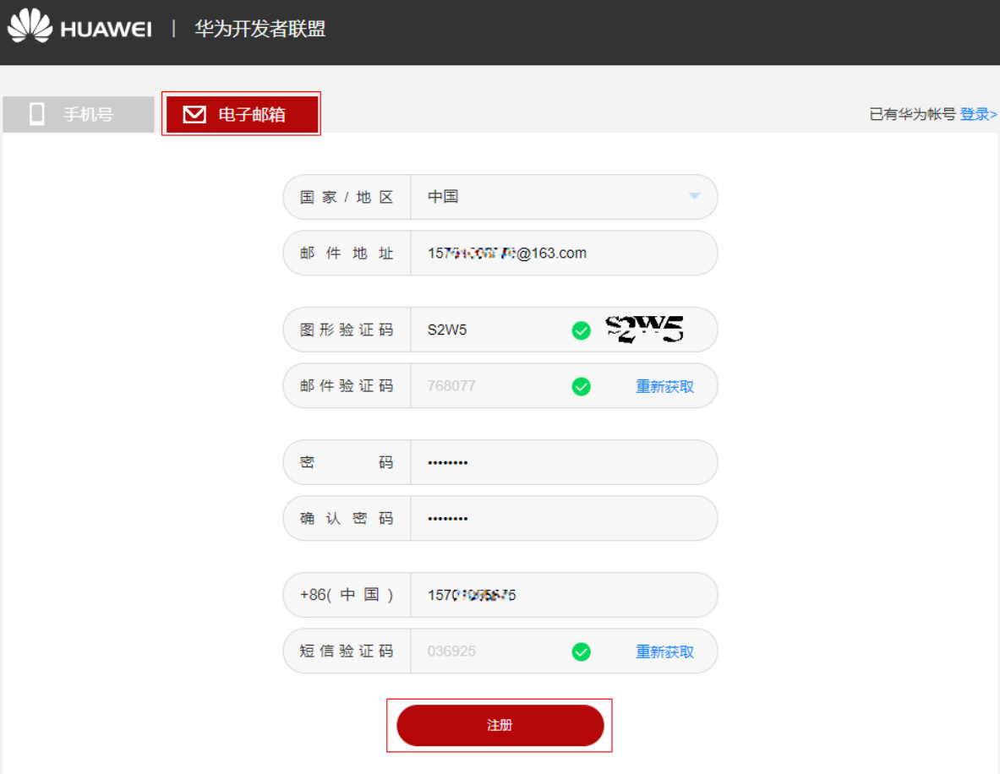

> 2.登录账号并实名认证，这里选择企业认证

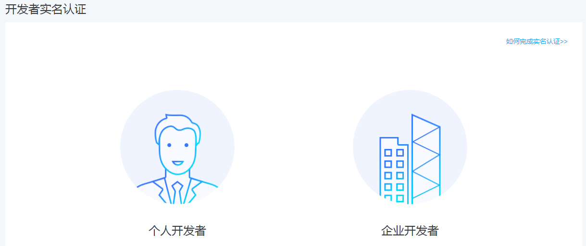

> 3.选择企业认证的方式：银行打款认证/人工审核

> 4.如果选择银行打款认证，在收到打款申请通知后的3个工作日内，请关注打款结果，收到打款后，登录开发者联盟进入“管理中心”输入打款金额并提交认证，系统审核后给出认证结果

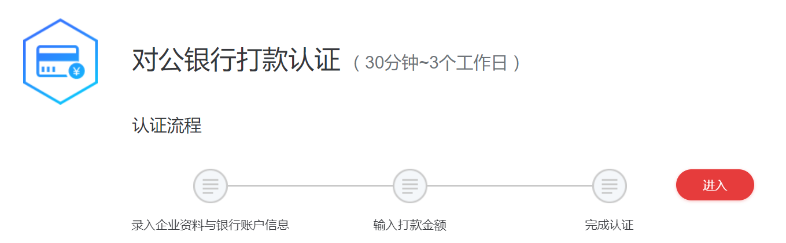

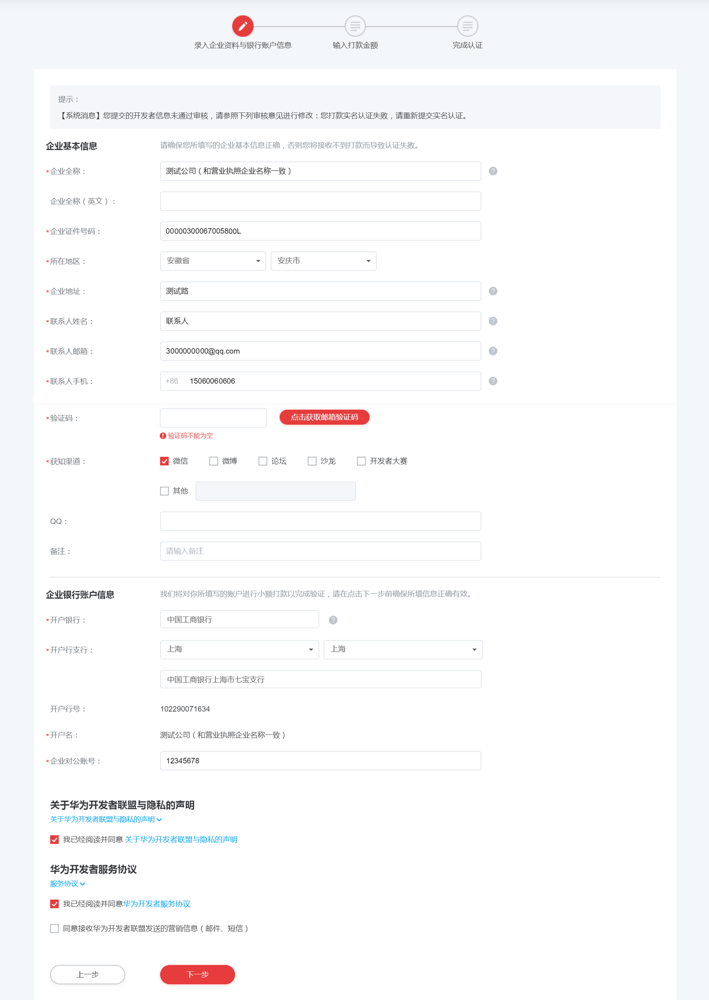

> 5.如果选择人工审核

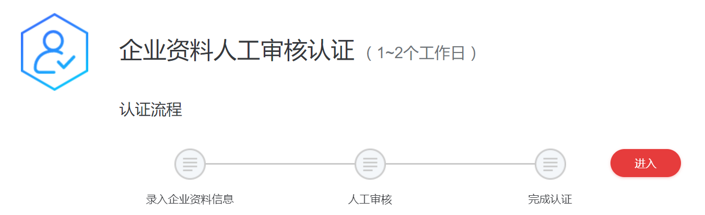

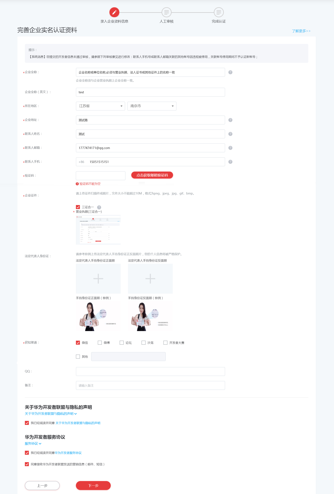

## 2. [小米开发者账号注册](https://dev.mi.com/console/doc/detail?pId=848)

### 2.1 权益

**应用商店、push、电视应用、快游戏、H5游戏、小米VR、应用统计、云测服务、应用市场推广、特殊类别应用收录（如金融、医疗）等**

### 2.2 开发者注册、认证材料

可接收验证码的手机号码、电子邮件地址、营业执照扫描件、未绑定小米支付银行借记卡（如开发者账号绑定的小米账号已被小米支付实名认证则无需准备）、如使用非企业域名邮箱注册需法人本人手持身份证件照

### 2.3 注册及认证流程

> 1.填写公司名称（可以是缩写. 简称）。

> 2.填写公司的相关信息

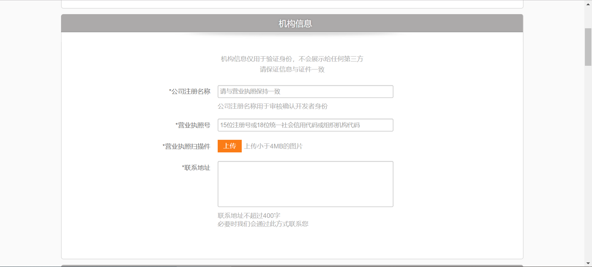

> 3.填写企业法人代表资料，如为企业域名注册开发者账，此部分信息不显示，因此无需填写。邮箱绑定地址：https://account.xiaomi.com；如使用非企业域名邮箱注册开发者账号，且无法获取企业法人手持身份证件照，请在信息提交完成后，提供该企业营业执照下三家应用市场后台截图邮件至：developer@xiaomi.com（备注开发者名称+注册邮箱）

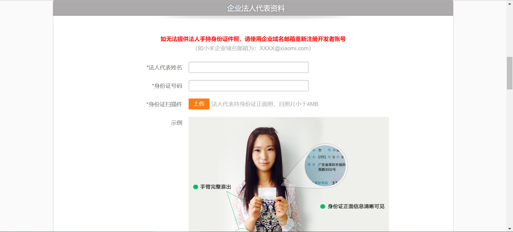

> 4.联系人实名认证及公司联系人邮箱及QQ填写：实名认证步骤同个人开发者实名认证步骤

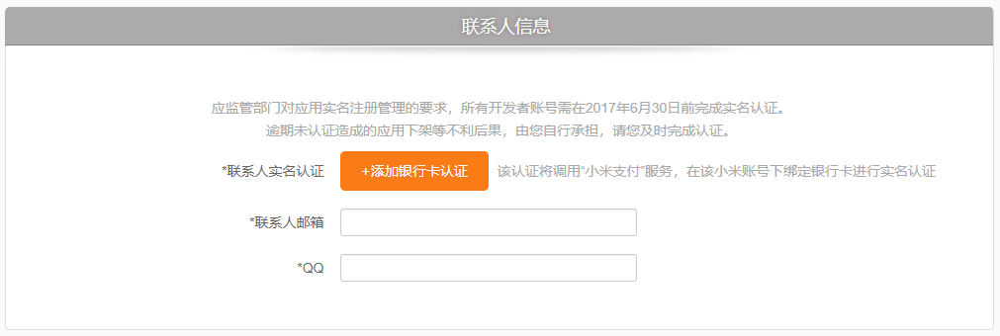

## 3. [OPPO开发者账号注册](https://open.oppomobile.com/wiki/doc#id=10446)

### 3.1 权益

**应用商店、push、应用统计、云测服务、应用市场推广等**

### 3.2 开发者注册、认证材料

企业营业执照、法人代表身份证要求：

1. 企业营业执照扫描件必须为彩色，要求照片清晰，字迹清楚，无遮挡或涂改；
2. 提供的营业执照经营范围必须与互联网有相关关系，否则不予审核通过；
3. 企业法人身份证照片要求提供正反两面，并且照片可以放大，照片清晰无遮挡；
4. 所有证件要求主体信息一致，并且真实有效，一经发现作假将永久冻结账号；

### 3.3 注册及认证流程

> 1.[注册OPPO开发者账号](https://id.oppo.com/register.html?type=1&callback=https%3A%2F%2Fopen.oppomobile.com)

> 2.登录账号并申请成为开发者

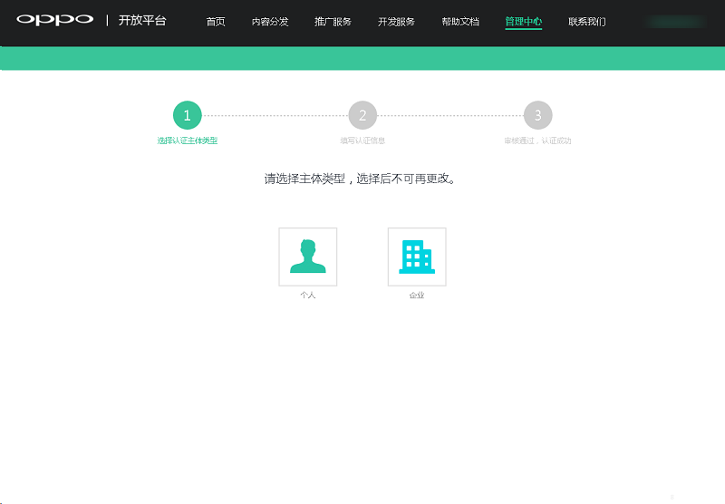

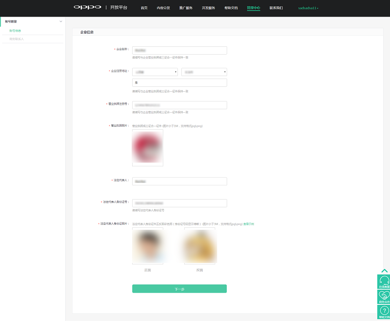

## 4. [vivo开发者账号注册](https://dev.vivo.com.cn/documentCenter/doc/2)

### 4.1 权益

**应用商店、push、应用统计、云测服务、应用市场推广等**

### 4.2 开发者注册、认证材料

企业开发者注册请准备以下资质（二选一）：

（1）营业执照、组织机构代码证、税务登记证、法人手持身份证照片

（2）营业执照（三证合一）、法人手持身份证照片

PS：“三证合一”，就是将企业依次申请的工商营业执照、组织机构代码证和税务登记证三证合为一证，证件名称为“营业执照”。对应的证件号码为18位数字+字母的统一社会信用代码。

资质上传证件扫描件（必须加盖公司公章），要求如下：

（1）证照必须在有效期内，且红色公章清晰可见

（2）提交的应用跟营业执照经营范围保持一致

（3）所有证照主体必须保持一致

（4）关键信息必须清晰，格式支持：JPG/PNG，每张图片大小2M以内

（5）企业法人本人手持身份证信息扫描件（必须与营业执照法人一致）， 需保证证件号码清晰可见

示例：

### 4.3 注册及认证流程

> 1.[注册vivo开发者账号](https://id.vivo.com.cn/?callback=http://devweb.vivo.com.cn&registerSource=1&_201908121735#!/access/register)

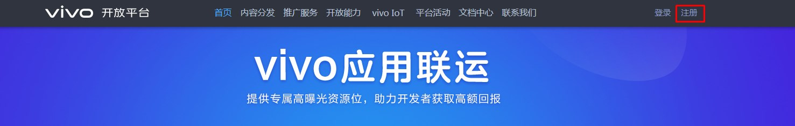
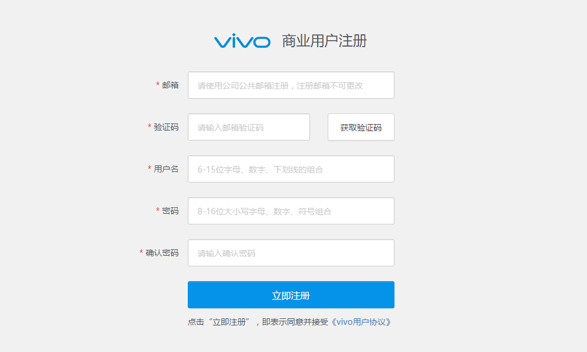

> 2.填写账户资料，上传企业资质，提交审核

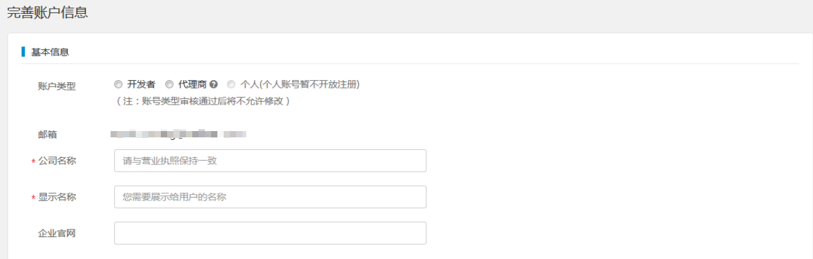

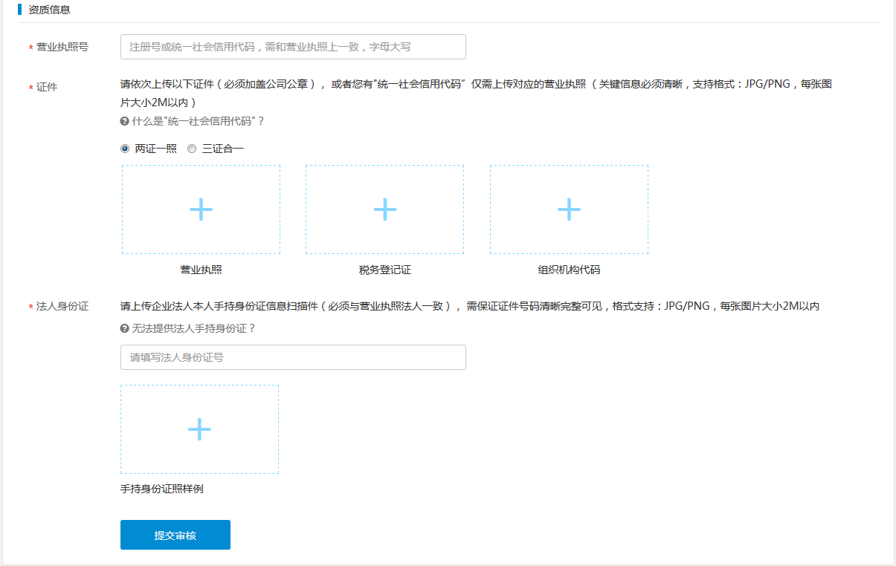

## 5. [魅族开发者账号注册](http://open-wiki.flyme.cn/doc-wiki/index#id?8)

### 5.1 权益

**应用商店、push、应用统计、云测服务、应用市场推广等**

### 5.2 开发者注册、认证材料

营业执照彩扫件（复印件盖公章彩扫）、法人身份证彩扫件（复印件盖公章彩扫）、联系人露脸手持身份证

### 5.3 注册及认证流程

> 1.[注册魅族Flyme账号](https://i.flyme.cn/register)

> 2.登录账号并申请成为开发者

> 3.填写相关信息，上传营业执照彩扫件（复印件盖公章彩扫）、法人身份证彩扫件（复印件盖公章彩扫）、联系人露脸手持身份证，填写正确的信息后提交，等待审核。

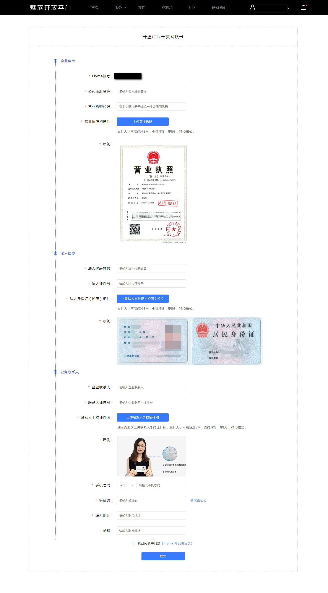

注册个人开发者时，“个人真实名称”和“身份证号”必须与提供照片的信息一致。企业同理，“公司信息”、“法人身份证信息”和“联系人身份证信息”必须与提供照片信息一致。

资料提交后，将会在三个【工作日】内审核完毕，超期请发邮件至open_flyme@meizu.com催审。

若申请不通过，在登录开发者中心时系统将提示申请不通过的原因，请按提示修改后重新提交申请。

# 华为、小米、OPPO、vivi、魅族应用市场上架

前提条件：

* 已注册为相应平台的企业开发者
* 计算机软件著作权证书，可以参考[中国版权保护中心 计算机软件著作权登记指南](http://www.ccopyright.com.cn/index.php?optionid=1033)办理；
* APP电子版权证书（可选），APP电子版权证书适用于华为应用市场，其他市场不适用，参考[易版权 APP软件著作权登记通道](http://www.yibanquan.com.cn/huaweiguide.jsp)办理；
* ICP 备案

> 1.华为应用商店

参考[https://developer.huawei.com/consumer/cn/devservice/doc/50102](https://developer.huawei.com/consumer/cn/devservice/doc/50102)

> 2.小米应用商店

参考[https://dev.mi.com/console/doc/detail?pId=878](https://dev.mi.com/console/doc/detail?pId=878)

> 3.OPPO应用商店

参考[https://open.oppomobile.com/wiki/doc#id=10035](https://open.oppomobile.com/wiki/doc#id=10035)

> 4.vivo应用商店

参考[https://dev.vivo.com.cn/documentCenter/doc/52](https://dev.vivo.com.cn/documentCenter/doc/52)

> 5.魅族应用商店

参考[http://open-wiki.flyme.cn/doc-wiki/index#id?14](http://open-wiki.flyme.cn/doc-wiki/index#id?14)

