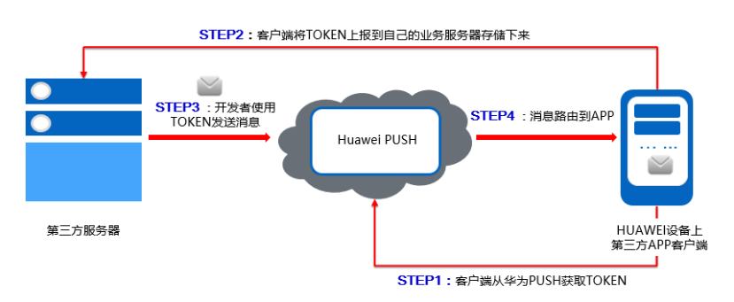

# 华为、小米、OPPO、vivo、魅族推送服务

参考：

> [华为推送服务](https://developer.huawei.com/consumer/cn/service/hms/catalog/huaweipush_agent.html?page=hmssdk_huaweipush_introduction_agent)

> [华为推送客户端API参考](https://developer.huawei.com/consumer/cn/service/hms/catalog/huaweipush_agent.html?page=hmssdk_huaweipush_api_reference_agent_c1)

> [华为推送服务端API参考](https://developer.huawei.com/consumer/cn/service/hms/catalog/huaweipush_agent.html?page=hmssdk_huaweipush_api_reference_agent_s1)

> [小米推送Android版快速接入指南](https://dev.mi.com/console/doc/detail?pId=100)

> [小米推送服务Android版客户端SDK使用指南](https://dev.mi.com/console/doc/detail?pId=41)

> [小米服务端Java SDK文档](https://dev.mi.com/console/doc/detail?pId=1278)

> [小米服务器API地址以及参数](https://dev.mi.com/console/doc/detail?pId=1163)

> [OPPO PUSH服务开启指南](https://open.oppomobile.com/wiki/doc#id=10195)

> [OPPO PUSH SDK接口文档](https://open.oppomobile.com/wiki/doc#id=10196)

> [OPPO PUSH服务端java SDK接入指南](https://open.oppomobile.com/wiki/doc#id=10203)

> [OPPO SDK下载](https://open.oppomobile.com/wiki/doc#id=10201)


> [vivo推送产品说明](https://dev.vivo.com.cn/documentCenter/doc/180)

> [vivo Android PUSH-SDK API集成指南](https://dev.vivo.com.cn/documentCenter/doc/233)

> [vivo Android PUSH-SDK API接口文档](https://dev.vivo.com.cn/documentCenter/doc/232)

> [vivo 服务端 SDK文档](https://dev.vivo.com.cn/documentCenter/doc/197)

> [vivo 服务端 PUSH-UPS-API接口文档](https://dev.vivo.com.cn/documentCenter/doc/155)


> [Flyme推送接入文档](http://open.res.flyme.cn/fileserver/upload/file/201612/728a49f530c64c5a832d7ba1de69e356.pdf)

> [Flyme推送Android客户端SDK文档](http://open.res.flyme.cn/fileserver/upload/file/201907/054259cd57014629b91db6b10a158ba3.pdf)

> [Flyme推送HTTP接口文档](http://open.res.flyme.cn/fileserver/upload/file/201803/be1f71eac562497f92b42c750196a062.pdf)

> [Flyme推送JAVA版本SDK接口文档](http://open.res.flyme.cn/fileserver/upload/file/201803/e174a5709f134f64aae3fb168aec8ea3.pdf)

> [Flyme推送SDK](http://open.res.flyme.cn/fileserver/upload/file/201907/c6ab8b399ad0482bbaff5b59e2cfc27c.rar)

> [Flyme推送服务端JAVA SDK](http://open.res.flyme.cn/fileserver/upload/file/201804/faa5ef883f6f4e74b9aaf550644dfe0e.zip)


* 通知栏消息 （五个推送服务都支持）

比如我们的IM消息通知，一般会显示在通知栏中，点击通知栏消息触发相应的动作，比如打开session、打开指定应用等等。

* 透传消息 （仅华为小米支持）

透传消息由开发者的APP自主解析自定义内容，并触发相关动作，比如我们的Meeting、PBX通知，会直接拉起一个界面。

## 1. 华为推送客户端开发

**如果需要在非华为系统EMUI的Android设备上使用华为推送服务，则需要额外安装HMS APK（华为移动服务），华为设备出厂自带不需要安装**

1. PUSH消息首次发送，应用在线联网的情况下，时延在1s内。如果受限于网络环境的情况，消息时延无法保证。
2. PUSH消息支持的Android APP包名称最大为128个字节，消息内容最大限制为2K。
3. 开发者应用服务器短时间内频繁申请Access Token会被网关流控，返回error=6错误码。
4. 开发者应用服务器短时间内发送大量的推送消息会被流控，返回HTTP 503状态码。



### 1.1 准备工作

集成华为推送服务需要完成以下几个步骤：

1. 注册认证成为开发者
2. 配置应用签名
3. 创建产品和应用
4. 开通推送服务
5. 下载SDK
6. 集成工程

其中前4个步骤可以参考[开发准备](https://developer.huawei.com/consumer/cn/service/hms/catalog/huaweipush_agent.html?page=hmssdk_huaweipush_devprepare_agent#4%20%E5%BC%80%E9%80%9A%E6%8E%A8%E9%80%81%E6%9C%8D%E5%8A%A1)，在华为推送相关网站完成。

**配置应用签名这个步骤非常重要，需要获取keystore的证书指纹SHA256**

这里重点说明一下SDK获取和项目集成，使用第三方推送服务一般都需要第三方PUSH服务器转发我们服务器发送的推送消息，因此在这个过程中客户端需要向第三方PUSH服务器请求token以及处理从PUSH服务器传过来的推送消息，一般来说第三方服务提供商就会提供集成了这些功能的SDK，因此我们需要将第三方SDK导入我们的项目中。

以华为推送为例，使用华为推送除了需要SDK，还需要HMS SDK Agent，HMS SDK Agent提供可以直接使用的接口；华为SDK可以通过Gradle+maven方式导入，HMS SDK Agent需要手动导入。

> 1.gradle中加入华为的仓库

```gradle
allprojects {
    repositories {
        google()
        jcenter()
        maven {
            url 'http://developer.huawei.com/repo/'
        }
    }
}
```

> 2.配置编译依赖

```gradle
 dependencies {
    implementation 'com.huawei.android.hms:push:2.6.1.301'
  }        
```

> 3.手动导入HMS SDK Agent，下载[HMSAgent_{version}.zip](https://obs.cn-north-2.myhwclouds.com/hms-ds-wf/sdk/HMSAgent_2.6.3.301.zip)，使用windows批处理脚本GetHMSAgent_cn.bat提取出PUSH模块，相关文件会保存到copysrc\文件夹下，然后将copysrc/java里面的代码拷到项目中去；

> 4.配置manifest文件

**在application节点下增加APPID**

```xml
<meta-data  
    android:name="com.huawei.hms.client.appid"  
    <!-- value的值“xxx”用实际申请的应用ID替换，来源于开发者联盟网站应用的服务详情。-->  
    android:value="appid=xxx">  
</meta-data>    
```

**配置application的name属性， 用于在application启动的时候调用HMSAgent.init()接口初始化HMS Agent套件，开发者需自己实现应用的MyApplication类**

```xml
<application

    <!-- “xxx”用实际的应用包名替换-->
    android:name="xxx.xxx.xxx.MyApplication"
    android:allowBackup="true"
    android:icon="@mipmap/ic_launcher"
    android:label="@string/app_name"
    android:roundIcon="@mipmap/ic_launcher_round"
    android:supportsRtl="true"
    android:theme="@style/AppTheme">
```

**在application节点下增加activity。BridgeActivity定义了HMS SDK中一些跳转所需要的透明页面**

```xml
<activity  
    android:name="com.huawei.hms.activity.BridgeActivity"  
    android:configChanges="orientation|locale|screenSize|layoutDirection|fontScale"  
    android:excludeFromRecents="true"  
    android:exported="false"  
    android:hardwareAccelerated="true"  
    android:theme="@android:style/Theme.Translucent" >  
    <meta-data  
        android:name="hwc-theme"  
        android:value="androidhwext:style/Theme.Emui.Translucent" />  
</activity>   
```

**AppUpdateActivity和PackageInstallActivity是应用自升级接口所需要使用的页面**

```xml
<activity
    android:name="com.huawei.updatesdk.service.otaupdate.AppUpdateActivity"
    android:configChanges="orientation|screenSize"
    android:exported="false"
    android:theme="@style/upsdkDlDialog" >

    <meta-data
        android:name="hwc-theme"
        android:value="androidhwext:style/Theme.Emui.Translucent.NoTitleBar" />
</activity>

<activity
    android:name="com.huawei.updatesdk.support.pm.PackageInstallerActivity"
    android:configChanges="orientation|keyboardHidden|screenSize"
    android:exported="false"
    android:theme="@style/upsdkDlDialog" >
    <meta-data
        android:name="hwc-theme"
        android:value="androidhwext:style/Theme.Emui.Translucent" />
</activity>
```

**在application节点下增加UpdateProvider，用于HMS SDK引导升级HMS APK，提供给系统安装器读取升级文件**

```xml
<provider  
    android:name="com.huawei.hms.update.provider.UpdateProvider"  
    <!--“xxx.xxx.xxx”用实际的应用包名替换-->  
    android:authorities="xxx.xxx.xxx.hms.update.provider"  
    android:exported="false"  
    android:grantUriPermissions="true" >  
</provider>
```

**在application节点下增加Service，用于应用自升级**

```xml
<!-- 应用下载服务 -->
<service android:name="com.huawei.updatesdk.service.deamon.download.DownloadService"
    android:exported="false"/>    
```

**在manifest节点下增加所需权限**

```xml
<!--HMS-SDK引导升级HMS功能，访问OTA服务器需要网络权限-->    
<uses-permission android:name="android.permission.INTERNET" />    
<!--HMS-SDK引导升级HMS功能，保存下载的升级包需要SD卡写权限-->    
<uses-permission android:name="android.permission.WRITE_EXTERNAL_STORAGE" />    
<!--检测网络状态-->  
<uses-permission android:name="android.permission.ACCESS_NETWORK_STATE"/>  
<!--检测wifi状态-->  
<uses-permission android:name="android.permission.ACCESS_WIFI_STATE"/>  
<!--为了获取用户手机的IMEI，用来唯一的标识用户。-->  
<uses-permission android:name="android.permission.READ_PHONE_STATE"/> 

<!--如果是安卓8.0，应用编译配置的targetSdkVersion>=26，请务必添加以下权限 -->
<uses-permission android:name="android.permission.REQUEST_INSTALL_PACKAGES" />

<!-- 接收PUSH TOKEN的广播以及PUSH消息需要定义该权限 ${PACKAGE_NAME} 要替换上您应用的包名 -->
    <permission
        android:name="${PACKAGE_NAME}.permission.PROCESS_PUSH_MSG"
        android:protectionLevel="signatureOrSystem"/>

<!--接收PUSH TOKEN的广播以及PUSH消息需要定义该权限 ${PACKAGE_NAME} 要替换上您应用的包名 -->
     <uses-permission android:name="${PACKAGE_NAME}.permission.PROCESS_PUSH_MSG" />
```

**在application节点下声明2个receiver和1个service，用于接收广播信息，用于接收PUSH Token，透传消息和通知栏点击消息**

```xml
  <!-- 接入HMSSDK PUSH模块需要注册，第三方相关 :接收Push消息（注册、透传消息、通知栏点击事件）广播，此receiver类需要开发者自己创建并继承com.huawei.hms.support.api.push.PushReceiver类，参考示例代码中的类：com.huawei.hmsagent.HuaweiPushRevicer-->

  <!--“xxx”用实际的类名替换, ${PACKAGE_NAME} 要替换上您应用的包名-->
  <receiver android:name="xxx"
         android:permission="${PACKAGE_NAME}.permission.PROCESS_PUSH_MSG">
            <intent-filter>
               <!-- 必须,用于接收token -->
               <action android:name="com.huawei.android.push.intent.REGISTRATION" />
               <!-- 必须, 用于接收透传消息 -->
               <action android:name="com.huawei.android.push.intent.RECEIVE" />
               <!-- 必须, 用于接收通知栏消息点击事件 此事件不需要开发者处理，只需注册就可以-->
               <action android:name="com.huawei.intent.action.PUSH_DELAY_NOTIFY"/>
            </intent-filter>
  </receiver>
```

**用于点击通知栏或通知栏上按钮后触发onEvent回调，这个通知会在后续版本中逐渐废弃，请开发者谨慎使用**

```xml
<!--如下2个通知会在以后的版本中逐渐废弃 
            接入HMSSDK PUSH模块需要注册，第三方相关 :接收Push消息（点击通知栏或通知栏上的按钮后触发onEvent回调、查看push通道是否连接）广播，          此receiver类需要开发者自己创建并继承com.huawei.hms.support.api.push.PushReceiver类，参考示例代码中的类：com.huawei.hmsagent.HuaweiPushRevicer类 -->

  <!--“xxx”用实际的类名替换, ${PACKAGE_NAME} 要替换上您应用的包名-->
  <receiver android:name="xxxx">
        <intent-filter>
            <!-- 用于点击通知栏或通知栏上的按钮后触发onEvent回调 -->
            <action android:name="com.huawei.android.push.intent.CLICK" />
            <!-- 查看push通道是否连接, 不查看则不需要 -->
            <action android:name="com.huawei.intent.action.PUSH_STATE"/>
        </intent-filter>
  </receiver>
```

**如果应用需要在非华为设备上使用PUSH，需要声明HmsMsgService**

```xml
<!--接入HMSSDK PUSH模块需要注册该service，不需要开发者处理-->
<service
        android:name="com.huawei.hms.support.api.push.service.HmsMsgService"
        android:enabled="true"
        android:exported="true"
        android:process=":pushservice">
        <intent-filter>
                <action android:name="com.huawei.push.msg.NOTIFY_MSG" />
                <action android:name="com.huawei.push.msg.PASSBY_MSG" />
        </intent-filter>
</service>     
```

**在application节点下注册android组件，解决华为移动服务升级问题的透明界面**

```xml
<activity
    android:name="com.huawei.android.hms.agent.common.HMSAgentActivity"
    android:configChanges="orientation|locale|screenSize|layoutDirection|fontScale"
    android:excludeFromRecents="true"
    android:exported="false"
    android:hardwareAccelerated="true"
    android:theme="@android:style/Theme.Translucent" >
    <meta-data
        android:name="hwc-theme"
        android:value="androidhwext:style/Theme.Emui.Translucent" />
</activity>    
```

> 5.配置混淆脚本

proguard-rules.pro

```pro
-ignorewarning
-keepattributes *Annotation*
-keepattributes Exceptions
-keepattributes InnerClasses
-keepattributes Signature
-keepattributes SourceFile,LineNumberTable
-keep class com.hianalytics.android.**{*;}
-keep class com.huawei.updatesdk.**{*;}
-keep class com.huawei.hms.**{*;}

-keep class com.huawei.android.hms.agent.**{*;}
```

### 1.2 客户端开发

HMS Agent 套件提供了对HMS SDK原生接口的二次封装，处理了部分必要的接入逻辑而不再将它们暴露给开发者，使用封装后的Agent接口接入HMS SDK，可大大提升接入效率，降低出错几率。

> 1.初始化

请务必在application的onCreate方法中初始化HMS Agent套件。如果没有自己的application类，请创建MyApplication类，并在manifest文件中配置application节点的name属性。

```java
public class MyApplication extends Application {
    @Override
    public void onCreate() {
        super.onCreate();
        HMSAgent.init(this);
    }

    @Override
    public void onTerminate() {
        super.onTerminate();
        HMSAgent.destroy();
    }
}
```

> 2.调用connect

请务必在应用启动后的首个activity的onCreate方法中调用connect接口，确保HMS SDK和HMS APK的连接。

```java
HMSAgent.connect(this, new ConnectHandler() {
    @Override
    public void onConnect(int rst) {
        showLog("HMS connect end:" + rst);
    }
});    
```

> 3.申请token

```java
HMSAgent.Push.getToken(new GetTokenHandler() {
    @Override
    public void onResult(int rtnCode) {
        Log.i("get token: end code=" , String.valueOf(rtnCode));
    }
});
```

建议开发者在首个activity的onCreate方法调用getToken方法，同一个手机的同一个应用获取的Token不会变，但是建议每次启动更新一次PUSH token。调用getToken接口后，Token不是在本接口中直接返回的，而是通过广播的形式通知APP因此需要开发者实现自定义广播的onToken方法来接收Token。

> 4.自定义广播接收消息

PUSH Token的返回，PUSH服务器发送的透传消息以及通知栏点击事件的处理都是通过广播来接收，因此开发者需要实现自定义广播，开发者需要创建子类继承com.huawei.hms.support.api.push.PushReceiver，实现onToken，onPushMsg，onEvent这几个方法，用于接收Token返回，透传消息和通知栏点击事件处理。

**onEvent会在后续版本中逐渐废弃，请开发者谨慎使用**

由于是通过广播触发，所以当应用的进程不存在时可能由于系统原因无法通过广播方式拉起应用处理通知栏点击事件等。需要在手机上面为应用设置“允许自启动”才能在进程不存在时正常处理PushReceiver的广播

**确保开发准备中manifest.xml的配置已完成**

```java
public class HuaweiPushReceiver extends PushReceiver {
    @Override
    public void onToken(Context context, String token, Bundle extras) {

               //开发者自行实现Token保存逻辑。
    }
    
    @Override
    public boolean onPushMsg(Context context, byte[] msg, Bundle bundle) {

               //开发者自行实现透传消息处理。
    }  

    @Override
    public void onEvent(Context context, Event event, Bundle extras) {

                //开发者自行实现相应处理逻辑
    }  
 }    
```

PUSH服务器返回Token后，开发者需要在onToken回调方法中将Token妥善的保存起来，例如存放到开发者的应用服务器上，此业务逻辑需要开发者自行实现。后续如果开发者的应用服务器实现了调用华为PUSH服务器端接口发送推送消息，开发者就可以向这些保存Token发送批量推送消息，此业务需要开发者参考实现《服务端开发》章节。

如果有涉及到在APP客户端和开发者自己的服务器之前传输Token,请开发者自行确保Token传输的安全。

**删除PUSH Token（可选）**

开发者如果不希望应用接收PUSH消息，可以调用deleteToken接口删除token，删除成功后，客户端就不会再接收到PUSH消息。但是建议开发者暂时不要依赖deleteToken接口，如果开发者要实现不接收PUSH消息，可以自行将开发者应用服务器端的Token状态设置为失效状态，并且在推送消息时判断是失效Token就不进行推送，避免频繁的向服务器申请token。

```java
private void deleteToken(){
        showLog("deleteToken:begin");
        HMSAgent.Push.deleteToken(token, new DeleteTokenHandler() {
            @Override
            public void onResult(int rst) {
                showLog("deleteToken:end code=" + rst);
            }
        });
    }
```

**是否接收PUSH通知栏消息（可选）**

如果开发者不调用此方法，默认是接收通知栏消息。在某些情况下，开发者如果想控制应用是否接收通知栏消息，可以调用此接口。

```java
/**
    * 设置接收通知消息 | Set up receive notification messages
    * @param enable 是否开启 | enabled or not
    */
private void setReceiveNotifyMsg(boolean enable){
    showLog("enableReceiveNotifyMsg:begin");
    HMSAgent.Push.enableReceiveNotifyMsg(enable, new EnableReceiveNotifyMsgHandler() {
        @Override
        public void onResult(int rst) {
            showLog("enableReceiveNotifyMsg:end code=" + rst);
        }
    });
}    
```

**是否接收PUSH透传消息（可选）**

如果开发者不调用此方法，默认是接收透传消息。在某些情况下，开发者如果想控制应用是否接收透传的PUSH消息，可以调用此接口。

```java
/**
    * 设置是否接收普通透传消息 | Set whether to receive normal pass messages
    * @param enable 是否开启 | enabled or not
    */
private void setReceiveNormalMsg(boolean enable){
    showLog("enableReceiveNormalMsg:begin");
    HMSAgent.Push.enableReceiveNormalMsg(enable, new EnableReceiveNormalMsgHandler() {
        @Override
        public void onResult(int rst) {
            showLog("enableReceiveNormalMsg:end code=" + rst);
        }
    });
} 
```

### 1.3 客户端测试

至此开发者已经完成了所有PUSH功能客户端的开发，开发者可以尝试将自己的android工程打包成apk安装到手机中进行测试，打包的时候请确保使用了正确的keystore证书，打包完成后开发者可以使用keytool命令获取apk的证书指纹，apk中的SHA256指纹信息必须和开发者在开发者联盟上创建应用的指纹保持一致。否则请检查apk打包过程的正确性。

如果需要测试客户端配置是否成功，可以通过[“PUSH控制台发送测试消息”](https://developer.huawei.com/consumer/cn/service/hms/catalog/huaweipush_agent.html?page=hmssdk_huaweipush_apptest_agent)来测试PUSH消息能否正确送达客户端。

## 2. 华为推送服务端开发


客户端开发：

* STEP1开发者的APP集成HMS SDK，调用getToken接口从PUSH服务器获取到PUSH Token。
* STEP2开发者的APP对于获取到的PUSH Token需要上报到开发者自己的服务器APP Provider Server上。

服务端开发：
* STEP3开发者利用服务器上保存的PUSH Token向对应的终端设备发送通知消息。
* STEP4消息携带的PUSH Token作为鉴权和路由机制会通过华为PUSH平台将消息发送到最终用户设备上。

### 2.1 应用服务器获取AccessToken

接口名：https://login.cloud.huawei.com/oauth2/v2/token，接口详细定义参见请求[Access Token](https://developer.huawei.com/consumer/cn/service/hms/catalog/huaweipush_agent.html?page=hmssdk_huaweipush_api_reference_agent_s1)。

接口说明：开发者应用服务器调用请求Access Token接口获取接入令牌，Access Token是应用服务器发送PUSH 消息的必须参数。

Access Token存在有效期，当前有效期为1个小时，未来可能有变动，有效期通过响应参数消息的expires_in参数传达。Access Token在有效期内请尽量复用，如果开发者应用服务器频繁的申请Access Token，可能会被流控。Access Token过期前，业务要根据这个有效时间提前去申请新Access Token。业务在API调用获知Access Token已经超过的情况下（NSP_STATUS=6），需要触发access_token的申请流程。

```java
public class PushNcMsg
{ 

    private static String appSecret = "appSecret";//用户在华为开发者联盟申请Push服务获取的服务参数

    private static  String appId = "12345678";//用户在华为开发者联盟申请Push服务获取的服务参数

    private static  String tokenUrl = "https://login.cloud.huawei.com/oauth2/v2/token"; //获取认证Token的URL
    private static  String apiUrl = "https://api.push.hicloud.com/pushsend.do"; //应用级消息下发API
    private static  String accessToken;//下发通知消息的认证Token
    private static  long tokenExpiredTime;  //accessToken的过期时间

   //省略部分代码

   …

    //获取Access Token
    private static void refreshToken() throws IOException
    {
        String msgBody = MessageFormat.format(
         "grant_type=client_credentials&client_secret={0}&client_id={1}", 
         URLEncoder.encode(appSecret, "UTF-8"), appId);
        String response = httpPost(tokenUrl, msgBody, 5000, 5000);
        JSONObject obj = JSONObject.parseObject(response);
        accessToken = obj.getString("access_token");
        tokenExpiredTime = System.currentTimeMillis() + (obj.getLong("expires_in") - 5*60)*1000;
    }
} 
```

### 2.2 应用服务器发送Push消息

接口名：openpush.message.api.send，接口详细定义参见请求服务端发送PUSH消息。

通过上一章节客户端的开发，使用getToken接口获取到的PUSH Token已被保存到开发者自己的应用服务器了，接下来开发者可以在自己的服务器封装PUSH消息，通过调用服务端的openpush.message.api.send接口，给这些设备批量推送消息了。

此开发步骤主要指导开发者如何封装PUSH请求消息，对于“通知栏消息”和“透传消息”有不同的参数可选，本章节以“场景介绍”中的“点击PUSH消息打开指定APP”为例，其他场景的详细参数定义参见[服务端发送PUSH接口](https://developer.huawei.com/consumer/cn/service/hms/catalog/huaweipush_agent.html?page=hmssdk_huaweipush_api_reference_agent_s2)，里面提供了封装完成的消息样例供开发者参考。

> 1.发送PUSH消息前判断AT是否过期，如果过期需要重新申请。其中refreshToken()为上一章节实现的获取AT的方法。

```java
if (tokenExpiredTime <= System.currentTimeMillis())        
    { 
        refreshToken();        
    }   
```

> 2.封装PUSH Token，PUSH Token为客户端调用getToken()接口获取到保存到服务器的，开发者需要读取服务器上的token，将其放到JSONArray中。服务器接口每次只支持发送100个，如需更大发送量，请参考[放开流控限制](https://developer.huawei.com/consumer/cn/help/60103)。

```java
/*PushManager.requestToken为客户端申请token的方法，可以调用多次以防止申请token失败*/
/*PushToken不支持手动编写，需使用客户端的onToken方法获取*/
JSONArray deviceTokens = new JSONArray();//目标设备Token
deviceTokens.add("12345678901234561234567890123456");
deviceTokens.add("22345678901234561234567890123456");
deviceTokens.add("32345678901234561234567890123456");
```

> 3.封装推送消息body，用于显示通知栏消息显示的标题和内容

```java
JSONObject body = new JSONObject();//仅通知栏消息需要设置标题和内容，透传消息key和value为用户自定义
body.put("title", "Push message title");//消息标题
body.put("content", "Push message content");//消息内容体
```

> 4.封装消息点击动作的参数，“com.huawei.hms.hmsdemo”为推送消息中需要打开的应用APK包名。请根据实际包名来修改。

```java
JSONObject param = new JSONObject();
param.put("appPkgName", "com.huawei.hms.hmsdemo");//定义需要打开的appPkgName
```

> 5.封装消息点击动作，用于定义通知栏点击行为，param为步骤4封装的点击动作参数

```java
JSONObject action = new JSONObject();
action.put("type", 3);//类型3为打开APP，其他行为请参考接口文档设置
action.put("param", param);//消息点击动作参数
```

> 6.封装消息类型，用于定义消息类型，区分是通知栏消息还是透传消息，其中action和body分别是步骤5和步骤3封装的消息。

```java
JSONObject msg = new JSONObject();
msg.put("type", 3);//3: 通知栏消息，异步透传消息请根据接口文档设置
msg.put("action", action);//消息点击动作
msg.put("body", body);//通知栏消息body内容示例代码
```

> 7.封装扩展消息，扩展消息中可以设置biTag用于消息打点，也可以携带customize参数用于触发通知栏点击事件的onEvent回调。

```java
JSONObject ext = new JSONObject();//扩展信息，含BI消息统计，特定展示风格，消息折叠。
ext.put("biTag", "Trump");//设置消息标签，如果带了这个标签，会在回执中推送给CP用于检测某种类型消息的到达率和状态

JSONObject temp= new JSONObject();
temp.put("season","Spring");
temp.put("weather","raining");
JSONArray customize = new JSONArray();  
customize.add(temp);
ext.put("customize",customize);
```

> 8.封装整个消息体，可自定义实现单击消息后的跳转动作。封装完整的消息体请参考[“payload消息体样例”](https://developer.huawei.com/consumer/cn/service/hms/catalog/huaweipush_agent.html?page=hmssdk_huaweipush_api_reference_agent_s2#3%20%E5%8F%82%E6%95%B0)。     

```java
JSONObject hps = new JSONObject();//华为PUSH消息总结构体
hps.put("msg", msg);
hps.put("ext", ext);

JSONObject payload = new JSONObject();
payload.put("hps", hps);
```

> 9.定义httpPost()方法，用于消息发送。

```java
public static String httpPost(String httpUrl, String data, int connectTimeout, int readTimeout) throws IOException
    {
        OutputStream outPut = null;
        HttpURLConnection urlConnection = null;
        InputStream in = null;
        
        try
        {
            URL url = new URL(httpUrl);
            urlConnection = (HttpURLConnection)url.openConnection();          
            urlConnection.setRequestMethod("POST");
            urlConnection.setDoOutput(true);
            urlConnection.setDoInput(true);
            urlConnection.setRequestProperty("Content-Type", "application/x-www-form-urlencoded; charset=UTF-8");
            urlConnection.setConnectTimeout(connectTimeout);
            urlConnection.setReadTimeout(readTimeout);
            urlConnection.connect();
            
            // POST data
            outPut = urlConnection.getOutputStream();
            outPut.write(data.getBytes("UTF-8"));
            outPut.flush();
            
            // read response
            if (urlConnection.getResponseCode() < 400)
            {
                in = urlConnection.getInputStream();
            }
            else
            {
                in = urlConnection.getErrorStream();
            }
            
            List<String> lines = IOUtils.readLines(in, urlConnection.getContentEncoding());
            StringBuffer strBuf = new StringBuffer();
            for (String line : lines)
            {
                strBuf.append(line);
            }
            System.out.println(strBuf.toString());
            return strBuf.toString();
        }
        finally
        {
            IOUtils.closeQuietly(outPut);
            IOUtils.closeQuietly(in);
            if (urlConnection != null)
            {
                urlConnection.disconnect();
            }
        }
    }
```

> 10.封装整个http消息并发送    

```java
String postBody = MessageFormat.format(
         "access_token={0}&nsp_svc={1}&nsp_ts={2}&device_token_list={3}&payload={4}",
            URLEncoder.encode(accessToken,"UTF-8"),
            URLEncoder.encode("openpush.message.api.send","UTF-8"),
            URLEncoder.encode(String.valueOf(System.currentTimeMillis() / 1000),"UTF-8"),
            URLEncoder.encode(deviceTokens.toString(),"UTF-8"),
            URLEncoder.encode(payload.toString(),"UTF-8"));

String postUrl = apiUrl + "?nsp_ctx=" + URLEncoder.encode("{\"ver\":\"1\", \"appId\":\"" + appId + "\"}", "UTF-8");
httpPost(postUrl, postBody, 5000, 5000);    //发送PUSH消息
```

> 11.透传消息相对于通知栏消息的请求参数封装少了很多，开发者只需要完成上面的步骤1、2、3、6、8、9、10

其中步骤3中对于透传消息不需要封装title和content只需要封装自定义的body内容。

封装透传消息的body

```java
JSONObject body = new JSONObject();
body.put("key1", "value1");//透传消息自定义body内容
body.put("key2", "value2");//透传消息自定义body内容
body.put("key3", "value3");//透传消息自定义body内容
```

### 2.3 通过消息回执实现自定义推送（可选）



本章节介绍如何根据消息回执的状态，来给特定用户发送消息。开发者需先在开发者联盟为应用[开通消息回执](https://developer.huawei.com/consumer/cn/service/hms/catalog/huaweipush_agent.html?page=hmssdk_huaweipush_devprepare_agent#3%20%E5%BC%80%E9%80%9A%E6%8E%A8%E9%80%81%E6%9C%8D%E5%8A%A1)。

消息回执是华为PUSH服务器提供的对应用服务器消息推送结果的通知。

例如，某开发者开发了一个APP，该APP的安装用户有100个。使用华为PUSH后，在开发者的服务器侧有100个对应PUSH Token，如果这100个用户中的10个用户已经将该APP卸载了，对于开发者是无法感知的，如果开发者还向这10个用户发送消息会存在问题，如图所描述，在回执消息中会将状态为2的消息应答状态回执给开发者。这样开发者就知道这10个用户已经卸载应用了，开发者可以不给这些应用发送消息。

消息回执由华为PUSH服务器发往开发者服务器，开发者需自行实现接口接收华为PUSH服务器发送的回执消息，回执接口详细定义参见[消息回执API](https://developer.huawei.com/consumer/cn/service/hms/catalog/huaweipush_agent.html?page=hmssdk_huaweipush_api_reference_agent_s3)。


### 2.4 服务端发送应用角标（可选）

开发者可以在PUSH消息中封装角标参数来发送给客户端展示对应的角标数量。

服务端发送PUSH角标需要在PUSH接口的Payload的ext中增加badgeAddNum、badgeClass配置参数，其他参数配置同正常的消息发送接口，消息封装方法参考[“应用服务器发送PUSH消息”](https://developer.huawei.com/consumer/cn/service/hms/catalog/huaweipush_agent.html?page=hmssdk_huaweipush_devguide_server_agent#3%20%E5%BA%94%E7%94%A8%E6%9C%8D%E5%8A%A1%E5%99%A8%E5%8F%91%E9%80%81Push%E6%B6%88%E6%81%AF)，接口详细参数定义参见[服务端发送PUSH接口](https://developer.huawei.com/consumer/cn/service/hms/catalog/huaweipush_agent.html?page=hmssdk_huaweipush_api_reference_agent_s2)。

```json
{                            
    "hps": {                                         
        "msg" : {                                        
            "type" : 3,                                        
            "body" : {                                        
                "content" : "Push message content", 
                "title" : "Push message content"                            
                },                                         
            "action" : {                                        
                "type" : 1,                                        
                "param" : {                                        
                    "intent":"#Intent;compo=com.rvr/.Activity;S.W=U;end"
                }                                        
            }                        
        },                                        
       "ext" : {                                        
            "badgeAddNum" : "1",
            "badgeClass" : "com.test.badge.MainActivity"
        }                                        
    }
}   
```

* badgeAddNum：角标数字，取值范围1-99

* badgeClass：桌面图标对应的应用入口Activity类

### 2.5 测试

至此开发者已完成所有客户端和服务端的开发工作，下一步可以通过调用应用服务器的接口测试PUSH消息能否正确的送达客户端。


## 小米推送服务

### 准备工作

> 1.登录小米开发者网站，创建App并获取AppId，AppKey和AppSecret。

在使用小米推送服务前，开发者需要先登录小米开发者网站（[https://dev.mi.com/console/](https://dev.mi.com/console/) ）创建App，在更多服务中查看AppId，AppKey和AppSecret（详细介绍请参见[《小米推送服务启用指南》](https://dev.mi.com/console/doc/detail?pId=68)）。其中AppId和AppKey是客户端的身份标识，在客户端SDK初始化时使用；AppSecret是服务器端的身份标识，在使用Server SDK向客户端发送消息时使用。

> 2.下载Android客户端SDK压缩包。

下载地址：[http://dev.xiaomi.com/mipush/downpage/](http://dev.xiaomi.com/mipush/downpage/) 。

压缩包中包含了Server SDK、Client SDK和android DEMO。

Android的SDK以jar形式提供，与华为推送类似，客户端在注册成功后，会得到服务器颁发的regId，之后可以通过订阅topic、设置alias等方式来接收推送消息。小米推送目前也支持两种消息传递方式：透传方式和通知栏方式。消息传到客户端后同样是通过广播的形式传递的。

> 3.配置AndroidManifest.xml文件

小米推送服务SDK支持的最低安卓版本为2.3。对应android:minSdkVersion = 9

```xml
<!-- 权限 -->
<uses-permission android:name="android.permission.WRITE_EXTERNAL_STORAGE" />​

<uses-permission android:name="android.permission.INTERNET" /> 

<uses-permission android:name="android.permission.ACCESS_NETWORK_STATE" />

<uses-permission android:name="android.permission.ACCESS_WIFI_STATE" /> 

<uses-permission android:name="android.permission.READ_PHONE_STATE" /> 

<uses-permission android:name="android.permission.GET_TASKS" /> 

<uses-permission android:name="android.permission.VIBRATE"/> 

<permission android:name="com.xiaomi.mipushdemo.permission.MIPUSH_RECEIVE"
android:protectionLevel="signature" /> <!--这里com.xiaomi.mipushdemo改成app的包名-->

<uses-permission android:name="com.xiaomi.mipushdemo.permission.MIPUSH_RECEIVE" /><!--这里com.xiaomi.mipushdemo改成app的包名-->
```

推送服务需要配置的service和receiver：

```java
<service android:enabled="true" android:process=":pushservice" android:name="com.xiaomi.push.service.XMPushService"/> 

<service android:name="com.xiaomi.push.service.XMJobService" android:enabled="true" android:exported="false" android:permission="android.permission.BIND_JOB_SERVICE" android:process=":pushservice" /> <!--注：此service必须在3.0.1版本以后（包括3.0.1版本）加入--> 

<service android:enabled="true" android:exported="true" android:name="com.xiaomi.mipush.sdk.PushMessageHandler" /> 

<service android:enabled="true" android:name="com.xiaomi.mipush.sdk.MessageHandleService" /> <!--注：此service必须在2.2.5版本以后（包括2.2.5版本）加入--> <receiver android:exported="true" android:name="com.xiaomi.push.service.receivers.NetworkStatusReceiver" > 

<intent-filter> 

<action android:name="android.net.conn.CONNECTIVITY_CHANGE" /> 

<category android:name="android.intent.category.DEFAULT" /> 

</intent-filter> 

</receiver> 

<receiver android:exported="false" android:process=":pushservice" android:name="com.xiaomi.push.service.receivers.PingReceiver" > 

<intent-filter> 

<action android:name="com.xiaomi.push.PING_TIMER" /> 

</intent-filter> 

</receiver>
```

这里将XMPushService和PingReceiver定义在了pushservice进程中，您也可以配置其运行在任意进程。如果没有配置android:process这个属性，那么它们将运行在应用的主进程中。

> 4.自定义一个BroadcastReceiver类

为了接收消息，您需要自定义一个继承自PushMessageReceiver类的BroadcastReceiver，实现其中的onReceivePassThroughMessage，onNotificationMessageClicked，onNotificationMessageArrived，onCommandResult和onReceiveRegisterResult方法，然后把该receiver注册到AndroidManifest.xml文件中。onReceivePassThroughMessage用来接收服务器发送的透传消息，onNotificationMessageClicked用来接收服务器发来的通知栏消息（用户点击通知栏时触发），onNotificationMessageArrived用来接收服务器发来的通知栏消息（消息到达客户端时触发，并且可以接收应用在前台时不弹出通知的通知消息），onCommandResult用来接收客户端向服务器发送命令消息后返回的响应，onReceiveRegisterResult用来接受客户端向服务器发送注册命令消息后返回的响应。 例如： 自定义的BroadcastReceiver

```java
public class DemoMessageReceiver extends PushMessageReceiver {
    private String mRegId;
    private long mResultCode = -1;
    private String mReason;
    private String mCommand;
    private String mMessage;
    private String mTopic;
    private String mAlias;
    private String mUserAccount;
    private String mStartTime;
    private String mEndTime;
    @Override
    public void onReceivePassThroughMessage(Context context, MiPushMessage message) {
        mMessage = message.getContent();
        if(!TextUtils.isEmpty(message.getTopic())) {
            mTopic=message.getTopic();
        } else if(!TextUtils.isEmpty(message.getAlias())) {
            mAlias=message.getAlias();
        } else if(!TextUtils.isEmpty(message.getUserAccount())) {
            mUserAccount=message.getUserAccount();
        }
    }
    @Override
    public void onNotificationMessageClicked(Context context, MiPushMessage message) {
        mMessage = message.getContent();
        if(!TextUtils.isEmpty(message.getTopic())) {
            mTopic=message.getTopic();
        } else if(!TextUtils.isEmpty(message.getAlias())) {
            mAlias=message.getAlias();
        } else if(!TextUtils.isEmpty(message.getUserAccount())) {
            mUserAccount=message.getUserAccount();
        }
    }
    @Override
    public void onNotificationMessageArrived(Context context, MiPushMessage message) {
        mMessage = message.getContent();
        if(!TextUtils.isEmpty(message.getTopic())) {
            mTopic=message.getTopic();
        } else if(!TextUtils.isEmpty(message.getAlias())) {
            mAlias=message.getAlias();
        } else if(!TextUtils.isEmpty(message.getUserAccount())) {
            mUserAccount=message.getUserAccount();
        }
    }
    @Override
    public void onCommandResult(Context context, MiPushCommandMessage message) {
        String command = message.getCommand();
        List<String> arguments = message.getCommandArguments();
        String cmdArg1 = ((arguments != null && arguments.size() > 0) ? arguments.get(0) : null);
        String cmdArg2 = ((arguments != null && arguments.size() > 1) ? arguments.get(1) : null);
        if (MiPushClient.COMMAND_REGISTER.equals(command)) {
            if (message.getResultCode() == ErrorCode.SUCCESS) {
                mRegId = cmdArg1;
            }
        } else if (MiPushClient.COMMAND_SET_ALIAS.equals(command)) {
            if (message.getResultCode() == ErrorCode.SUCCESS) {
                mAlias = cmdArg1;
            }
        } else if (MiPushClient.COMMAND_UNSET_ALIAS.equals(command)) {
            if (message.getResultCode() == ErrorCode.SUCCESS) {
                mAlias = cmdArg1;
            }
        } else if (MiPushClient.COMMAND_SUBSCRIBE_TOPIC.equals(command)) {
            if (message.getResultCode() == ErrorCode.SUCCESS) {
                mTopic = cmdArg1;
            }
        } else if (MiPushClient.COMMAND_UNSUBSCRIBE_TOPIC.equals(command)) {
            if (message.getResultCode() == ErrorCode.SUCCESS) {
                mTopic = cmdArg1;
            }
        } else if (MiPushClient.COMMAND_SET_ACCEPT_TIME.equals(command)) {
            if (message.getResultCode() == ErrorCode.SUCCESS) {
                mStartTime = cmdArg1;
                mEndTime = cmdArg2;
            }
        } 
    }
    @Override
    public void onReceiveRegisterResult(Context context, MiPushCommandMessage message) {
        String command = message.getCommand();
        List<String> arguments = message.getCommandArguments();
        String cmdArg1 = ((arguments != null && arguments.size() > 0) ? arguments.get(0) : null);
        String cmdArg2 = ((arguments != null && arguments.size() > 1) ? arguments.get(1) : null);
        if (MiPushClient.COMMAND_REGISTER.equals(command)) {
            if (message.getResultCode() == ErrorCode.SUCCESS) {
                mRegId = cmdArg1;
            }
        } 
    }
}
```

将自定义的BroadcastReceiver注册到AndroidManifest.xml文件中

```xml
<receiver
  android:exported="true"
  android:name="com.xiaomi.mipushdemo.DemoMessageReceiver">
          <!--这里com.xiaomi.mipushdemo.DemoMessageRreceiver改成app中定义的完整类名-->
  <intent-filter>
    <action android:name="com.xiaomi.mipush.RECEIVE_MESSAGE" />
  </intent-filter>
    <intent-filter>
    <action android:name="com.xiaomi.mipush.MESSAGE_ARRIVED" />
  </intent-filter>
  <intent-filter>
    <action android:name="com.xiaomi.mipush.ERROR" />
  </intent-filter>
</receiver>
```

注意：

上述方法运行在非UI线程中。
如果你的应用使用了混淆，你需要keep自定义的BroadcastReceiver。自定义的BroadcastReceiver继承PushMessageReceiver，使用下面的代码是不行的:

`-keep public class * extends android.content.BroadcastReceiver`

你需要使用下面的代码keep自定义的BroadcastReceiver。#这里com.xiaomi.mipushdemo.DemoMessageRreceiver改成app中定义的完整类名 

`-keep class com.xiaomi.mipush.sdk.DemoMessageReceiver {*;}`

> 5.调试日志

在自定义Application的onCreate方法加入如下代码。

```java
LoggerInterface newLogger = new LoggerInterface() {
     @Override
     public void setTag(String tag) {
         // ignore
     }
     @Override
     public void log(String content, Throwable t) {
         Log.d(TAG, content, t);
     }
     @Override
     public void log(String content) {
         Log.d(TAG, content);
     }
};
Logger.setLogger(this, newLogger);
```

注：默认情况下，我们会将日志内容写入SDCard/Android/data/app pkgname/files/MiPushLog目录下的文件。如果app需要关闭写日志文件功能（不建议关闭），只需要调用Logger.disablePushFileLog(context)即可。

> 6.注册推送服务

通过调用MiPushClient.registerPush来初始化小米推送服务。注册成功后，您可以在自定义的onCommandResult和onReceiveRegisterResult中收到注册结果，其中的regId即是当前设备上当前app的唯一标示。您可以将regId上传到自己的服务器，方便向其发消息。 

为了提高push的注册率，您可以在Application的onCreate中初始化push。您也可以根据需要，在其他地方初始化push。 代码如下：

```java
public class DemoApplication extends Application {

    public static final String APP_ID = "your appid";
    public static final String APP_KEY = "your appkey";
    public static final String TAG = "your packagename";

    @Override
    public void onCreate() {
        super.onCreate();
        //初始化push推送服务
        if(shouldInit()) {
            MiPushClient.registerPush(this, APP_ID, APP_KEY);
        }
        //打开Log
        LoggerInterface newLogger = new LoggerInterface() {

            @Override
            public void setTag(String tag) {
                // ignore   
            }

            @Override
            public void log(String content, Throwable t) {
                Log.d(TAG, content, t);
            }

            @Override
            public void log(String content) {
                Log.d(TAG, content);
            }
        };
        Logger.setLogger(this, newLogger);
    }

    private boolean shouldInit() {
        ActivityManager am = ((ActivityManager) getSystemService(Context.ACTIVITY_SERVICE));
        List<RunningAppProcessInfo> processInfos = am.getRunningAppProcesses();
        String mainProcessName = getApplicationInfo().processName();
        int myPid = Process.myPid();
        for (RunningAppProcessInfo info : processInfos) {
            if (info.pid == myPid && mainProcessName.equals(info.processName)) {
                return true;
            }
        }
        return false;
    }
}
```

注意：

* 因为推送服务XMPushService在AndroidManifest.xml中设置为运行在另外一个进程，这导致本Application会被实例化两次，所以我们需要让应用的主进程初始化。
* 在非MIUI平台下，如果targetSdkVersion>=23，需要动态申请电话和存储权限，请在申请权限后再调用注册接口，否则会注册失败。

> 7.设置alias、userAccount和订阅topic

在注册成功，收到regId之后，即可调用MiPushClient.setAlias来设置alias，调MiPushClient.setUserAccount来设置userAccount，调MiPushClient.subscribe订阅topic。 alias可以理解为regId的别名，开发者可以将alias设置为自己应用帐号系统的帐号，或者设备标识等。然后在使用Server SDK发送消息的时候，即可直接指定发送给特定的alias，而不是regId，避免存储regId。 开发者可以在不同设备上设置同一个userAccount。然后使用Server SDK给该userAccount发送消息；此时，所有设置了该userAccount的设备都可以收到消息。 主题用来做广播消息。不同手机上的同一个app可以订阅同一个主题。通过发送主题消息的API，即可同时向所有订阅该主题的客户端发送消息。比如，您有一个新闻类的app，可以自定义“财经”、“体育”、“科技“等主题；对于经常阅读财经新闻的用户，您可以帮用户订阅“财经”类主题，当有新的财经要闻发生时，直接通过主题推送该新闻给所有订阅该主题的用户。

> 8.通知消息处理

目前通知类的消息， 通知的图标展示规则如下：

* 如果app中同时存在名为mipush_notification和mipush_small_notification的drawable文件，则使用mipush_notification的drawable作为通知的大图标，mipush_small_notification的drawable作为通知的小图标。
* 如果app中只存在其中一个drawable文件，则使用该drawable作为通知的图标。
* 如果app中不存在这两个drawable文件，则使用app的icon作为通知的图标。在MIUI中，通知栏图标统一显示为app的icon，不可以定制。

通知消息分为自定义通知消息和预定义通知消息。 如果服务端调用Message.Builder类的extra(String key, String value)方法设置了Constants.EXTRA_PARAM_NOTIFY_EFFECT的值，则为预定义通知消息（具体细节请参见[《服务端Java SDK文档》](https://dev.mi.com/console/doc/detail?pId=1278#_3_2)）；否则为自定义通知消息。 如果在小米推送服务开发者站推送消息，需要通过指定“点击后续动作”来指定通知消息类型。 通知消息到达客户端后会在通知栏弹出notification，这时候消息已经传到PushMessageReceiver继承类的onNotificationMessageArrived方法，但这时候消息还没有通过PushMessageReceiver继承类的的onNotificationMessageClicked方法传到客户端。当用户点击了自定义通知消息，消息会通过onNotificationMessageClicked方法传到客户端。 

**注意：用户点击了预定义通知消息，消息不会通过onNotificationMessageClicked方法传到客户端。** 

> 9.客户端定义不同的通知栏消息点击行为，分为以下四种

* 1.自定义通知消息的处理

服务端没有设置Constants.EXTRA_PARAM_NOTIFY_EFFECT的值表示是自定义通知消息。客户端收到自定义通知消息后，可以自定义一些操作。 比如：通过启动一个Activity将消息传过去，这时需要给Intent添加FLAG_ACTIVITY_NEW_TASK。

```java
intent.addFlags(Intent.FLAG_ACTIVITY_NEW_TASK);
```

透传消息和自定义通知消息的处理参考代码如下：

```java
public void onReceivePassThroughMessage(Context context, MiPushMessage message)
{ 
  mMessage = message.getContent(); 
  if(!TextUtils.isEmpty(message.getTopic())) { 
    mTopic=message.getTopic(); 
 } 
else if(!TextUtils.isEmpty(message.getAlias())) {
  mAlias=message.getAlias(); 
 } 
}

public void onNotificationMessageClicked(Context context, MiPushMessage message) 
{ 
  mMessage = message.getContent(); 
  if(!TextUtils.isEmpty(message.getTopic())) {
   mTopic=message.getTopic(); 
  } 
  else if(!TextUtils.isEmpty(message.getAlias())) { 
    mAlias=message.getAlias(); 
  }
}

public void onNotificationMessageArrived(Context context, MiPushMessage message) 
{ 
  mMessage = message.getContent(); 
  if(!TextUtils.isEmpty(message.getTopic())) {
    mTopic=message.getTopic(); 
  }
  else if(!TextUtils.isEmpty(message.getAlias())) {
    mAlias=message.getAlias(); 
  } 
}
```

* 2.打开当前app对应的Launcher Activity

服务端调用Message.Builder类的extra(String key, String value)方法，将key设置为Constants.EXTRA_PARAM_NOTIFY_EFFECT，value设置为Constants.NOTIFY_LAUNCHER_ACTIVITY。具体请参见[《服务端Java SDK文档》](https://dev.mi.com/console/doc/detail?pId=1278#_3_2)。封装消息的MiPushMessage对象通过Intent传到客户端，客户端在相应的Activity中可以调用Intent的getSerializableExtra（PushMessageHelper.KEY_MESSAGE）方法得到MiPushMessage对象。

* 3.打开当前app内的任意一个Activity

服务端调用Message.Builder类的extra(String key, String value)方法，将key设置为Constants.EXTRA_PARAM_NOTIFY_EFFECT，value设置为Constants.NOTIFY_ACTIVITY。具体请参见[《服务端Java SDK文档》](https://dev.mi.com/console/doc/detail?pId=1278#_3_2)。封装消息的MiPushMessage对象通过Intent传到客户端，客户端在相应的Activity中可以调用Intent的getSerializableExtra（PushMessageHelper.KEY_MESSAGE）方法得到MiPushMessage对象。

* 4.打开网页

服务端调用Message.Builder类的extra(String key, String value)方法，将key设置为Constants.EXTRA_PARAM_NOTIFY_EFFECT，value设置为Constants.NOTIFY_WEB。具体请参见[《服务端Java SDK文档》](https://dev.mi.com/console/doc/detail?pId=1278#_3_2)。

> 10.自定义通知栏

服务端在发送消息时可以自定义通知栏效果

* 1.自定义通知栏消息铃声

服务端发送消息时调用Message.Builder类的extra(String key, String value)方法将key设置为Constants.EXTRA_PARAM_SOUND_URI，value设置为铃声的URI。 注：

* 铃声只能使用当前app内的资源，URI格式满足 android.resource://your packagename/XXX/XXX。
* 铃声文件放在Android app的raw目录下。

Demo：

```java
private Message buildMessage() throws Exception {
     String PACKAGENAME = "com.xiaomi.mipushdemo";
     String messagePayload = “This is a message”;
     String title = “notification title”;
     String description = “notification description”;
     Message message = new Message.Builder()
             .title(title)
             .description(description).payload(messagePayload)
             .restrictedPackageName(MY_PACKAGE_NAME)
             .passThrough(0)  //消息使用通知栏方式
             .notifyType(1)
             .extra(Constants.EXTRA_PARAM_SOUND_URI, "android.resource://" + PACKAGENAME + "/raw/shaking")
             .build();
     return message;
}
```

* 2.自定义通知栏样式

如果系统默认的通知栏样式不满足需求，开发者可以自定义通知栏样式。服务端推送消息通过指定layout文件和填充内容，自由定制展示样式。 注意，在MIUI中，通知展示由系统通道负责，需要MIUI升级后才支持自定义通知。 具体使用方法如下：

1. layout文件中只能包含以下控件: FrameLayout, LinearLayout, RelativeLayout, Button, ImageButton, ImageView, ProgressBar, TextView；
2. 调用Message.Builder类的extra(String key, String value)方法将以“layout_name”为key，value设置为客户端要展示的layout文件名；
3. 以“layout_value”为key，指定layout中各控件展示的内容，其value为一个Json。其格式为{“text”:{“txt_res_name1”:”txt_value1”, “txt_res_name2”:”txt_value2”…}, “image”:{“img_res_name1”:”img_value1”, “img_res_name2”:”img_value2”…}, “time”:{“time_res_name”:”format_value”}}。

其中：txt_res_name为layout文件中的控件名字，txt_value为控件上需要展示的文本内容。 img_res_name为layout中需要展示图片资源的控件名字，img_value为程序中对应的资源名。 time_res_name为layout文件中的控件名字，format_value为控件上需要展示的时间format样式。默认 yy-MM-dd hh:mm。 Demo: 以下消息，将指定以custom_notify为通知栏样式，将其中的titleText设置为“我是标题”，descText设置为“我是描述”；将iconImage设置为icon对应的图片。


```java
private Message buildMessage() throws Exception {
     String PACKAGENAME = "com.xiaomi.mipushdemo";
     String messagePayload = “This is a message”;
     String title = “notification title”;
     String description = “notification description”;
     Message message = new Message.Builder()
             .title(title)
             .description(description).payload(messagePayload)
             .restrictedPackageName(MY_PACKAGE_NAME)
             .passThrough(0)  //消息使用通知栏方式
             .notifyType(1)
             .extra("layout_name","custom_notify")
             .extra("layout_value", "{\"text\":{\"titleText\":\"标题\"},\"image\": {\"iconImage\": \"icon\"},
                                      \"time\": {\"timeText\": \"HH:mm\"}}")​
             .build();
     return message;
}
```

> 11.Proguard 配置

如果使用了 proguard，需要在配置文件中加入：

```pro
#这里com.xiaomi.mipushdemo.DemoMessageRreceiver改成app中定义的完整类名
-keep class com.xiaomi.mipush.sdk.DemoMessageReceiver {*;}
#可以防止一个误报的 warning 导致无法成功编译，如果编译使用的 Android 版本是 23。
-dontwarn com.xiaomi.push.**
```

## OPPO推送服务

OPPO推送服务文档与小米文档几乎类似，同样需要开通账号，申请PUSH服务，获得AppId、AppKey、AppSecret等验证信息。下载最新的SDK压缩包，其中包括了Server SDK、Client SDK、Android Demo。

Android的SDK以jar和aar形式提供，第三方APP只需要添加少量代码即可接入OPPO推送服务；

推送服务客户端SDK主要功能接口请参考详细API说明；

客户端在注册成功后，会得到服务器颁发的RegId，然后可以通过订阅Topic、设置Alias来接收推送消息。

### 1. 添加资源和依赖

* 解压缩集成压缩包；

* 复制com.coloros.mcssdk.jar到工程 libs/ 目录下；

* 在IDE中导入对jar的依赖,不同IDE稍有区别；

* Eclipse:直接将jar包复制到工程 libs/目录下即可自动依赖；

* Android Studio:需要在工程的build.gradle文件中添加如下配置代码：

```xml
dependencies {
    ...
    compile fileTree(dir: 'libs', include: ['opush_xxx.jarcom.coloros.mcssdk.jar']) //添加opush jar
```

### 2. 配置AndroidManifest.xml

OPPO推送服务SDK支持的最低安卓版本为Android 4.0系统。

```xml
<uses-sdk  android:minSdkVersion="14"/>
```

```xml
<!-- 权限 -->
<uses-permission android:name="com.coloros.mcs.permission.RECIEVE_MCS_MESSAGE"/>
```

推送服务组件注册

```xml
<service
   android:name="com.coloros.mcssdk.PushService"     android:permission="com.coloros.mcs.permission.SEND_MCS_MESSAGE">
    <intent-filter>
     <action android:name="com.coloros.mcs.action.RECEIVE_MCS_MESSAGE"/>
    </intent-filter>
</service>
```

### 3. 注册推送服务

1)由于不是所有平台都支持OPPO PUSH，提供接口PushManager.isSupportPush(Context)方便应用判断是否支持，支持才能继续后续操作，否则后续操作会抛出异常。

2)通过调用PushManager.getInstance().register(...)来初始化Opush推送服务.注册成功后,您可以在PushCallback的onRegister回调方法中得到regId,您可以将regId上传到自己的服务器，方便向其发消息。初始化相关参数具体要求参考详细API说明中的初始化部分.此接口会抛出异常，需要应用捕获处理。

3)为了提高push的注册率，你可以在Application的onCreate中初始化push。你也可以根据需要，在其他地方初始化push。如果第一次注册失败,第二次可以直接调用PushManager.getInstance().getRegister()进行重试,此方法默认会使用第一次传入的参数掉调用注册。

### 4. 混淆配置

```pro
-keep public class * extends android.app.Service
```

### 5. 详细API说明

PushManager接口定义

```java
/**
     *判断是否手机平台是否支持PUSH
     *@param context必须传入当前app的application context
     *@return true 表示手机平台支持PUSH, false表示不支持
     */
    boolean isSupportPush(Context context)
 
     /**
     * 注册OPush推送服务
     * @param applicatoinContext必须传入当前app的applicationcontet
     * @param appKey 在开发者网站上注册时生成的，与appID相对应，用于验证appID是否合法
     * @param pushCallback SDK操作的回调，如不需要使用所有回调接口，可传入PushAdapter，选择需要的回调接口来重写
     */
    void register(Context applicatoinContext, String appKey, String appSecret, PushCallback pushCallback);
 
    /**
     * 设置appKey等参数,可以覆盖register中的appkey设置
     * @param appKey 在开发者网站上注册时生成的key
     * @param appSecret
     */
    void setAppKeySecret(String appKey, String appSecret);
 
    /**
     * 设置sdk操作回调处理,可以覆盖register中的PushCallback设置
     * @param pushCallback sdk操作回调处理
     */
    void setPushCallback(PushCallback pushCallback);
 
    /**
     * 解注册OPush推送服务
     */
    void unRegister();
 
    /**
     * 获取注册OPush推送服务的注册ID
     */
    void getRegister();
 
    /**
     * 为指定用户设置aliases
     *
     * @param aliases 为指定用户设置别名
     */
@Deprecated
    void setAliases(List<String> aliases);
 
    /**
     * 取消指定用户的aliases
     *
     * @param aliases 用户设置的别名
     */
@Deprecated
    void unsetAliases(List<String> aliases);
 
    /**
     * 方法返回了客户端设置的别名列表(如果客户端没有设置别名，则返回空列表)
     */
@Deprecated
    void getAliases();
 
     /**
     * 为某个用户设置订阅topic
     *
     * @param tags 用户设置的订阅topic
     */
@Deprecated
    void setTags(List<String> tags);
 
    /**
     * 取消某个用户的订阅topic
     *
     * @param tags 用户设置的订阅topic
     */
@Deprecated
    void unsetTags(List<String> tags);
 
    /**
     * 方法返回了客户端订阅的主题列表(如果客户端没有订阅主题，则返回空列表)
     */
@Deprecated
    void getTags();
 
    /**
     * 暂停接收OPush服务推送的消息
     */
    void pausePush();
 
    /**
     * 恢复接收OPush服务推送的消息，这时服务器会把暂停时期的推送消息重新推送过来
     */
    void resumePush();
 
    /**
     * 获取OPush推送服务状态
     */
    void getPushState();
 
    /**
     * 获取OPush推送服务SDK版本
     *
     * @return SDKVersion
     */
    String getSDKVersion();
 
    /**
     * 获取OPush推送服务MCS版本
     *
     * @return PushVersion
     */
    String getPushVersion();
 
    /**
     * 设置允许推送时间 API
     *
     * @param weekDays 周日为0,周一为1,以此类推
     * @param startHour 开始时间,24小时制
     * @param endHour 结束时间,24小时制
     */
    void setPushTime(List<Integer> weekDays, int startHour, int start         Min, int endHour, int endMin);
```

应用在没有获取到registerId时,需要先调用register进行初始化,初始化成功后才可以进行后续操作。如果调用register注册失败,可以调用getRegister使用上一次传入的参数进行重试。

PushCallback，PushAdapter

```java
1)接口定义
//注册的结果,如果注册成功,registerID就是客户端的唯一身份标识
void onRegister(int responseCode, String registerID);
//反注册的结果
void onUnRegister(int responseCode);
 
//alias操作结果,3个回调分别对应设置alias,取消alias,获取alias列表.如果操作成功,参数alias里面会包含操作成功的alias列表
void onSetAliases(int responseCode, List<SubscribeResult> alias);
void onUnsetAliases(int responseCode, List<SubscribeResult> alias);
void onGetAliases(int responseCode, List<SubscribeResult> alias);
 
//user account操作结果,3个回调分别对应设置account,取消account,获取account列表.如果操作成功,参数accounts里面会包含操作成功的account列表
void onSetUserAccounts(int responseCode, List<SubscribeResult> accounts);
void onUnsetUserAccounts(int responseCode, List<SubscribeResult> accounts);
void onGetUserAccounts(int responseCode, List<SubscribeResult> accounts);
 
//订阅标签(tag)操作结果,3个回调分别对应设置tag,取消tag,获取tag列表.如果操作成功,参数tags里面会包含操作成功的tag列表
void onSetTags(int responseCode, List<SubscribeResult> tags);
void onUnsetTags(int responseCode, List<SubscribeResult> tags);
void onGetTags(int responseCode, List<SubscribeResult> tags);
 
//获取当前的push状态返回,根据返回码判断当前的push状态,返回码具体含义可以参考[错误码]
void onGetPushStatus(int responseCode,int status);
public class PushStatus {
    public static final int PUSH_STATUS_START = 0;
    public static final int PUSH_STATUS_PAUSE = 1;
    public static final int PUSH_STATUS_STOP = 2;
}
void onGetNotificationStatus(int responseCode,int status);
public class NotificatoinStatus {
    public static final int STATUS_OPEN = 0;
    public static final int STATUS_CLOSE = 1;
}
```

所有回调都需要根据responseCode来判断操作是否成功，0 代表成功,其他代码失败，失败具体原因可以查阅附录中的错误码列表。

onRegister接口返回的registerID是当前客户端的唯一标识，app开发者可以上传保存到应用服务器中,在发送push消息是可以指定registerID发送。

alias,account,tag相关接口的返回参数中,如果操作成功，则参数中的List会返回操作成功的对象的列表,getxxx方法则会返回服务端保存的[alias/account/tag]列表。如果失败，则列表为空。

### 6. 错误码定义说明

参考类com.coloros.mcssdk.mode.ErrorCode中的错误码定义进行处理，详细如下：

1)ERROR = -2;  //initvalue初始值

2)SERVICE_CURRENTLY_UNAVAILABLE = -1;  //Service Currently Unavailable  服务不可用，此时请开发者稍候再试

3)SUCCESS = 0;  //成功，只表明接口调用成功

4)INSUFFICIENT_ISV_PERMISSIONS = 11;  //Insufficient ISV Permissions 无此API调用权限，开发者权限不足

5)HTTP_ACTION_NOT_ALLOWED = 12;  //Http Action Not Allowed HTTP 方法不正确

6)APP_CALL_LIMITED = 13;  //App Call Limited 应用调用次数超限，包含调用频率超限

7)INVALID_APP_KEY = 14;  // Invalid App Key 无效的AppKey参数

8)MISSING_APP_KEY = 15;  //Missing App Key 缺少AppKey参数

9)INVALID_SIGNATURE_SIGN = 16;  //Invalid Signature sign校验不通过，无效签名

10)MISSING_SIGNATURE = 17;  //Missing Signature 缺少签名参数

11)MISSING_TIMESTAMP = 18;  //Missing Timestamp 缺少时间戳参数

12)NVALID_TIMESTAMP = 19;  //Invalid Timestamp 非法的时间戳参数

13)INVALID_METHOD = 20;  //Invalid Method 不存在的方法名

14)MISSING_METHOD = 21;  //Missing Method 缺少方法名参数

15)MISSING_VERSION = 22;  //Missing Version 缺少版本参数

16)INVALID_VERSION = 23;  //Invalid Version 非法的版本参数，用户传入的版本号格式错误，必需为数字格式

17)UNSUPPORTED_VERSION = 24;  //Unsupported Version 不支持的版本号，用户传入的版本号没有被提供

18)INVALID_ENCODING = 25;  //Invalid encoding 编码错误，一般是用户做http请求的时候没有用UTF-8编码请求造成IP_BLACK_LIST = 26;//IP Black List IP黑名单

19)MISSING_REQUIRED_ARGUMENTS = 40;  //Missing Required Arguments 缺少必选参数 ，API文档中设置为必选的参数是必传的，请仔细核对文档20)INVALID_ARGUMENTS = 41;  //Invalid Arguments 参数错误，一般是用户传入参数非法引起的，请仔细检查入参格式、范围是否一一对应

## vivo推送服务

vivo推送支持标签全量、RegID、Alias、imei四种消息发送方式。有点类似小米，同样需要先在平台上注册申请，然后配置、下载SDK等等

**基于RegID的推送**

RegID为vivo推送为每个设备上的每个app注册推送服务时生成的唯一标示。

当开发者需要给一个或多个具体的设备推送消息时，可以使用基于 RegID的推送，将个性化的信息推送给指定的设备。这种方式适用于需要为每个用户订制个性化推送的场景。 

注：

* RegID是在客户端向vivo推送服务注册时，vivo推送服务端根据设备标识、AppID以及当前时间戳生成，因此能够保证每个设备上每个app对应的regID都是不同的。

* RegID在应用卸载或清除本地数据后会重新生成或者7天不联网

* RegID在如下几种情况下会被判断失效：

    ① App卸载重装或者清除数据后重新注册，这种情况下会生成一个新的RegID，而老的RegID会失效；

    ② App调用了turnOffpush；

    ③ 在vivo 上，App卸载时，如果能成功上报，则RegID会被判定失效；

    ④ 设备超过7天没有和vivo Push服务器建立长连接；


**基于Alias的推送**

alias是vivo推送提供的一种个性化设定, 开发者可以将用户在应用内的账号或其它用户唯一标识设定为用户设备 RegID 的别名，在推送中可以直接基于别名进行推送。

别名不仅方便开发者将推送与自有的账号系统进行关联，同时也避免了因需要保存设备 RegID 与自有帐号的对应关系而额外带来的开发和存储成本。 

注：

* alias与RegID(设备)一一对应，同一个alias不能对应多个RegID，alias对应的RegID以最后一次setalias对应的RegID为准；

* alias失效的可能原因如下：

    ①  主动调用unsetalias；

    ② alias对应的RegID已经失效；

* alias只跟设备相关，所以请使用用户账号作为alias时，合理判断alias可能失效的情况。 

### 1. 导入推送jar包

将解压后的libs文件夹中vivo_pushsdk-VERSION.jar(vivo_pushsdk-VERSION.jar为集成的jar包名字，VERSION为版本名称)拷贝到您的工程的libs文件夹中。

### 2. 配置AndroidManifest文件

```xml
<?xml version="1.0" encoding="utf-8"?>
<manifest xmlns:android="http://schemas.android.com/apk/res/android"
    package="com.vivo.pushdemo.test">

    <uses-permission android:name="android.permission.INTERNET" />

    <application
        android:allowBackup="false"
        android:icon="@mipmap/ic_launcher"
        android:label="@string/app_name"
        android:supportsRtl="true"
        android:theme="@style/AppTheme">
        <activity android:name="com.vivo.push.sample.MainActivity">
            <intent-filter>
                <action android:name="android.intent.action.MAIN" />

                <category android:name="android.intent.category.LAUNCHER" />
            </intent-filter>
        </activity>

        <service
            android:name="com.vivo.push.sdk.service.CommandClientService"
            android:exported="true" />
        <activity
            android:name="com.vivo.push.sdk.LinkProxyClientActivity"
            android:exported="false"
            android:screenOrientation="portrait"
            android:theme="@android:style/Theme.Translucent.NoTitleBar" />

        <!-- push应用定义消息receiver声明 -->
        <receiver android:name="com.vivo.push.sample.PushMessageReceiverImpl">
            <intent-filter>
                <!-- 接收push消息 -->
                <action android:name="com.vivo.pushclient.action.RECEIVE" />
            </intent-filter>
        </receiver>

        <meta-data
            android:name="com.vivo.push.api_key"
            android:value="xxxxxxxxxxxxxxxxxxxxxxxxxxxxxxxx" />
        <meta-data
            android:name="com.vivo.push.app_id"
            android:value="xxxxx" />

    </application>

</manifest>
```

### 3. 启动云推送

```java
// 建议Application的onCreate方法中执行
PushClient.getInstance(getApplicationContext()).initialize();
PushClient.getInstance(getApplicationContext()).turnOnPush(new IPushActionListener() {

    @Override
    public void onStateChanged(int state) {
        if (state != 0) {
            updateContent("打开push异常[" + state + "]");
        } else {
            updateContent("打开push成功");
        }
    }
});
```

### 4. 自定义回调类

```java
public class PushMessageReceiverImpl extends OpenClientPushMessageReceiver {
    /**
     * TAG to Log
     */
    public static final String TAG = PushMessageReceiverImpl.class.getSimpleName();

    @Override
    public void onNotificationMessageClicked(Context context, UPSNotificationMessage msg) {
        String customContentString = msg.getSkipContent();
        String notifyString = "通知点击 msgId " + msg.getMsgId() + " ;customContent=" + customContentString;
        Log.d(TAG, notifyString);

        // Demo更新界面展示代码，应用请在这里加入自己的处理逻辑
        updateContent(notifyString);
    }

    @Override
    public void onReceiveRegId(Context context, String regId) {
        String responseString = "onReceiveRegId regId = " + regId;
        Log.d(TAG, responseString);
        updateContent(responseString);
    }
}
```

### 5. 处理推送消息

接收通知消息

当设备接收到通知消息后，查看手机的通知栏，可以看到通知栏内的该新通知展示。当点击通知时，回调PushMessageReceiverImpl#onNotificationMessageClicked方法。

### 6. 混淆说明

```pro
-downwarn com.vivo.push.**
-keep class com.vivo.push.**{*; }
-keep class xxx.xxx.xxx.PushMessageReceiverImpl{*;}
```

## 魅族推送服务

功能基本类似上面几个推送服务(透传功能停用)，直接看Android端配置

### 1. 魅族推送的SDK发布到jcenter，所以可以通过gradle导入

```gradle
dependencies {
    compile 'com.meizu.flyme.internet:push-internal:3.8.3'
}
```

### 2. AndroidManifest.xml

```xml
<!-- 兼容 Flyme5 以下版本，魅族内部接入 PushSDK 必填，不然无法收到消息-->
 <uses-permission android:name="com.meizu.flyme.push.permission.RECEIVE" />
 <permission android:name="【替换您的包名】.push.permission.MESSAGE"
android:protectionLevel="signature"/>
 <uses-permission android:name="【替换您的包名】.push.permission.MESSAGE" />
 <!-- 兼容 Flyme3 配置权限-->
 <uses-permission android:name="com.meizu.c2dm.permission.RECEIVE" />
 <permission android:name="【替换您的包名】.permission.C2D_MESSAGE" android:protectionLevel="signature"
/>
 <uses-permission android:name="【替换您的包名】.permission.C2D_MESSAGE"/>
```

注册消息接收的广播

```xml
<!-- push 应用定义消息 receiver 声明 -->
 <receiver android:name="【替换您的包名】.MyPushMsgReceiver">
 <intent-filter>
 <!-- 接收 push 消息 -->
 <action android:name="com.meizu.flyme.push.intent.MESSAGE" />
 <!-- 接收 register 消息 -->
 <action android:name="com.meizu.flyme.push.intent.REGISTER.FEEDBACK" />
 <!-- 接收 unregister 消息-->
 <action android:name="com.meizu.flyme.push.intent.UNREGISTER.FEEDBACK"/>
 <!-- 兼容低版本 Flyme3 推送服务配置 -->
 <action android:name="com.meizu.c2dm.intent.REGISTRATION" />
 <action android:name="com.meizu.c2dm.intent.RECEIVE" />
 <category android:name="【替换您的包名】" />
 </intent-filter>
 </receiver>
```

### 3. 实现消息接收的广播

```java
public class MyPushMsgReceiver extends MzPushMessageReceiver {
    @Override
    @Deprecated
    public void onRegister(Context context, String s) {
        // 调用旧版的订阅 PushManager.register(context) 方法后，
        // 会在此回调订阅状态（已废弃）
    }

    @Override
    @Deprecated
    public void onUnRegister(Context context, boolean b) {
        // 调用旧版的反订阅 PushManager.unRegister(context) 方法后，
        // 会在此回调反订阅状态（已废弃）
    }

    @Override
    public void onRegisterStatus(Context context, RegisterStatus registerStatus) {
        // 调用新版的订阅 PushManager.register(context,appId,appKey) 方法后，
        // 会在此回调订阅状态
    }

    @Override
    public void onUnRegisterStatus(Context context, UnRegisterStatus unRegisterStatus) {
        // 调用新版的反订阅 PushManager.unRegister(context,appId,appKey) 方法后，
        // 会在此回调订阅状态
    }

    @Override
    public void onPushStatus(Context context, PushSwitchStatus pushSwitchStatus) {
        // 调用 PushManager.switchPush/checkPush 方法后，
        // 会在此回调通知栏和透传消息的开关状态
    }

    @Override
    public void onSubTagsStatus(Context context, SubTagsStatus subTagsStatus) {
        // 调用 PushManager.subScribeTags/unSubScribeTags/unSubScribeAllTags
        // /checkSubScribeTags 方法后，会在此回调标签相关信息
    }

    @Override
    public void onSubAliasStatus(Context context, SubAliasStatus subAliasStatus) {
        // 调用 PushManager.subScribeAlias/unSubScribeAlias/checkSubScribeAlias
        // /checkSubScribeTags 方法后，会在此回调别名相关信息
    }

    @Override
    public void onUpdateNotificationBuilder(PushNotificationBuilder pushNotificationBuilder) {
        // 兼容旧版本 Flyme 系统中设置消息弹出后状态栏中的小图标
        // 同时请在相应的 drawable 不同分辨率文件夹下放置一张名称务必为
        // mz_push_notification_small_icon 的图片
        pushNotificationBuilder.setmStatusbarIcon(R.drawable.mz_push_notification_small_icon);
    }

    @Override
    public void onNotificationClicked(Context context, MzPushMessage mzPushMessage) {
        // 当用户点击通知栏消息后会在此方法回调
    }

    @Override
    public void onNotificationArrived(Context context, MzPushMessage mzPushMessage) {
        // 当推送的通知栏消息展示后且应用进程存在时会在此方法回调
    }
}
```

### 4. Application onCreate

```java
PushManager.register(this, APP_ID, APP_KEY);
```
