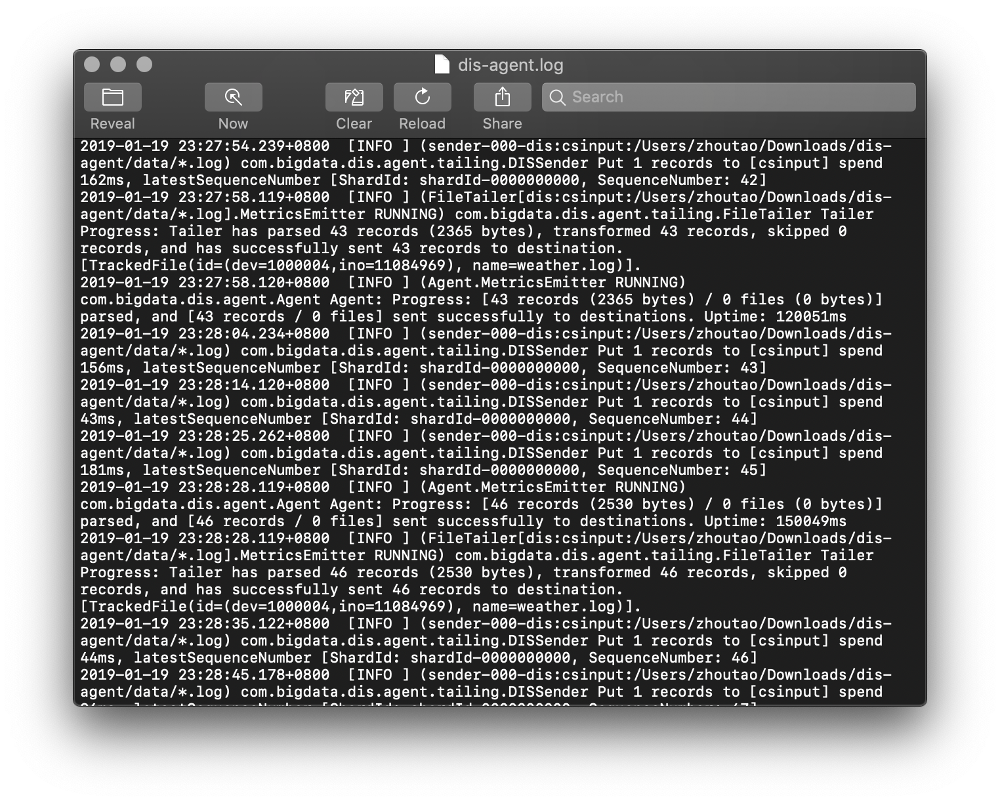
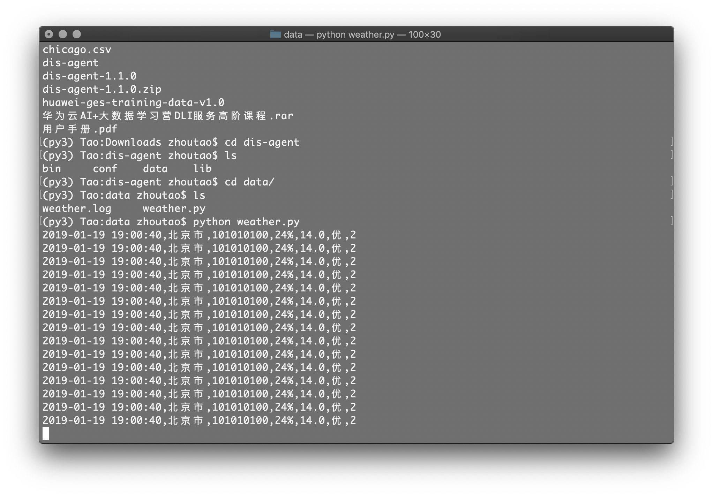
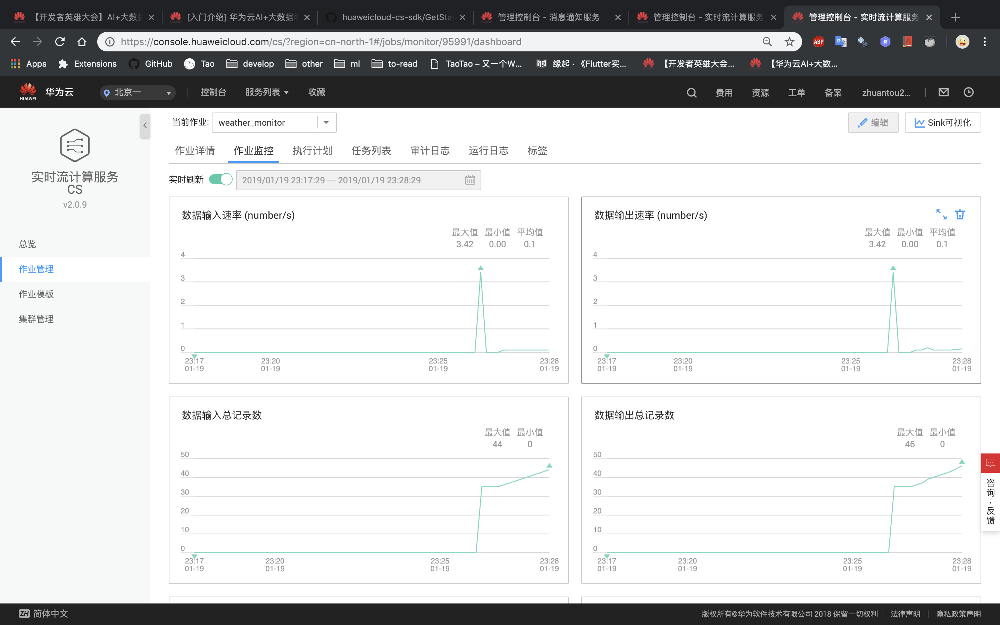
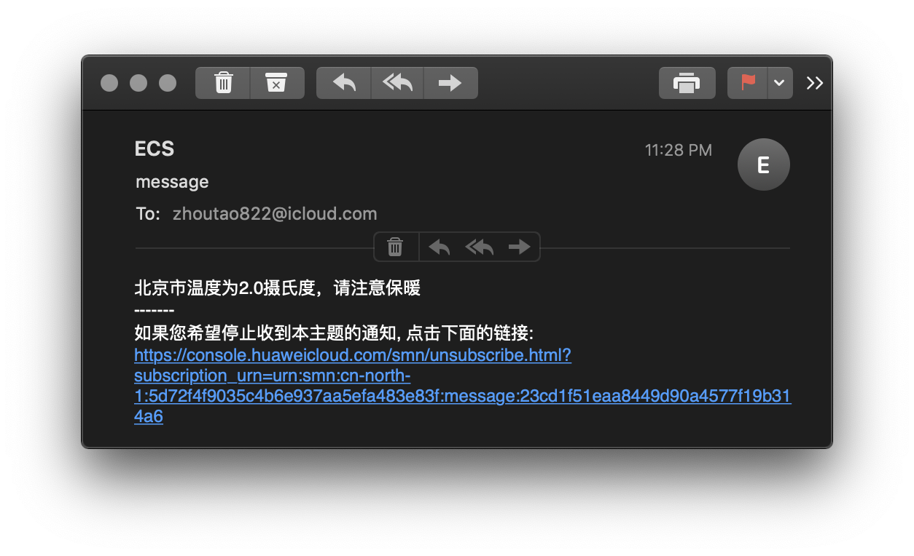

# 实时流计算服务 CS

## 1. CS服务说明

具体可以参考官网 https://console.huaweicloud.com/cs/?region=cn-north-1#/dashboard ，根据我的学习了解，CS服务提供了一种监控预警的流水线系统。首先是监控，当我们关注的某些数据更新后，通过DIS agent上传至CS服务，然后通过Flink SQL作业任务筛选出以及判断关键数据是否符合要求，然后根据实际情况向用户发送消息，看到这里你看已经蒙了，但是后面会用我的实验过程消息描述。

## 2. 服务对象

当我做完基础实验后基本了解了整个过程，实验是监控车速并预警，同理，很显然容易想到类似的使用场景，比如监控股票涨跌（这个对实时性要求较高）、灾害天气预警（这个可以有）、热点新闻推送（这个可以，但没必要）等等，根据上文介绍的流程以及我举出的例子，相信你已经明白了我接下来要介绍的CS服务。

本文建立在天气预警案例上，我的目标是获取北京市天气信息，若在一段时间内天气温度始终低于某个温度5摄氏度，那就发送预警消息。当然这只是简单的流程，理论上完整的天气预警应该是面向多个城市，实时性要求相对较高，判断条件应该是未来1到2小时内的天气预测信息，以及最高温度、最低温度、湿度和PM25等信息进行综合评价，然后发送给用户一个通过机器学习预测的结果。

## 3. 实现过程

### 3.1 天气数据获取

天气数据一般的获取手段是通过api获取，市面上有很多免费或者收费的api，发送请求就可以得到数据，还有一种傻一点的方式，通过爬虫爬取页面的天气信息。后者相对复杂，前者简单，但是需要靠谱的数据源，我这里找到了一个免费公开的api，然后用python获取数据并写入到文件中。

```python
# ==============================================================================
"""向log文件中定时写入数据模拟天气变化
版本：
    Python：3.6.7
参考：
    https://www.sojson.com/blog/305.html
数据来源不知名小站，天气免费api，源数据格式json，目标是解析json文件，获取data，
按照10秒写入一次当前数据模拟天气的动态变化，样例请求的是北京天气，city_code为101010100，
api：http://t.weather.sojson.com/api/weather/city/101010100，最后面是city_code
"""

import json
import time
import requests


def get_weather_data(city_code='101010100'):
    """根据city_code获取json数据，CS服务接受json数据，但是不熟悉，所以还是最后使用csv
    数据样例:
    {
        "time": "2019-01-19 19:00:40",
        "cityInfo":{
            "city": "北京市",
            "cityId": "101010100",
            "parent": "北京",
            "updateTime": "18:47"
        },
        "date": "20190119",
        "message": "Success !",
        "status": 200,
        "data":{
            "shidu": "24%",
            "pm25": 14,
            "pm10": 37,
            "quality": "优",
            "wendu": "2",
            "ganmao": "各类人群可自由活动",
            "yesterday":{"date": "18", "sunrise": "07:34", "high": "高温 6.0℃", "low": "低温 -6.0℃",…},
            "forecast":[{"date": "19", "sunrise": "07:33", "high": "高温 4.0℃", "low": "低温 -5.0℃",…]
        }
    }
    Args:
        city_code: 城市代码，比如北京是101010100
    Returns:
        data: 解析并筛选的数据
    """
    url = ('http://t.weather.sojson.com/api/weather/city/{}').format(city_code)
    # requests获取到的数据是byte类型，我们decode为utf-8
    response = requests.get(url)
    data = response.content.decode('utf-8')
    # decode后得到str类型数据，若满足条件：数组或对象之中的字符串必须使用双引号，
    # 不能使用单引号，则可以使用json.loads解析为json字典数据
    data = json.loads(data)
    return data

def write2log(weather_data, file_path='./weather.log', delay=10):
    """将得到的list数据写入到.log文件中
    Args:
        weather_data: 解析得到的数据
        file_path: log文件保存路径
        delay: 模拟的时间间隔 单位秒
    """
    my_weather_data = []
    my_weather_data.append(weather_data['time'])
    my_weather_data.append(weather_data['cityInfo']['city'])
    my_weather_data.append(weather_data['cityInfo']['cityId'])
    my_weather_data.append(weather_data['data']['shidu'])
    my_weather_data.append(str(weather_data['data']['pm25']))
    my_weather_data.append(weather_data['data']['quality'])
    my_weather_data.append(weather_data['data']['wendu'])

    my_weather_data = ','.join(my_weather_data)
    print(my_weather_data)
    with open(file_path, 'a+') as file:
        file.write(str(my_weather_data) + '\n')
    time.sleep(delay)

if __name__ == "__main__":
    for i in range(200):
        data = get_weather_data()
        write2log(data)

```

### 3.2 DIS Agent配置

基本是按照实验步骤配置的，通道、主题、订阅什么的就省略不写了，因为可以复用

```yml
---
# cloud region id
region: cn-north-1
# user ak (get from 'My Credential')
ak: AK
# user sk (get from 'My Credential')
sk: SK
# user project id (get from 'My Credential')
projectId: XX
# the dis gw endpoint
endpoint: https://dis.cn-north-1.myhuaweicloud.com:20004
# config each flow to monitor file.
flows:
  # DIS stream
  - DISStream: csinput
    # only support specified directory, filename can use * to match some files. eg. * means match all file, test*.log means match test1.log or test-12.log and so on.
    filePattern: /Users/zhoutao/Downloads/dis-agent/data/*.log
    # from where to start: 'START_OF_FILE' or 'END_OF_FILE'
    initialPosition: START_OF_FILE
    # upload max interval(ms)
    maxBufferAgeMillis: 5000
```

启动DIS Agent并且启动天气数据写入的脚本后成功运行的log日志（在log文件夹下）



python脚本运行结果



### 3.3 Flink SQL作业配置

大体上是参照基础实验做的，小部分的内容进行了修改，sql不会，随便改了点代码，理论上来说这个是直接支持json文件的，但是我还是按照样例csv来搞了

```sql
/**
  *
  * >>>>>样例输入<<<<<
  *  流名: weather_data(WeatherTime,City,CityID,Shidu,PM25,Quality,Wendu):
  *  2019-01-19 19:00:40,北京市,101010100,24%,14.0,优,2
  * >>>>>样例输出<<<<<
  *  流名: weather_info(WeatherTime,City,Shidu,PM25,Quality,Wendu):
  *  2019-01-19 19:00:40,北京市,24%,14.0,优,2
  *  流名: low_wendu_msg(MessageContent)
  *  北京市温度为2摄氏度，请注意保暖
  **/
  
/** 创建输入流，从DIS的csinput通道获取数据。
  *
  * 根据实际情况修改以下选项：
  * channel：数据所在通道名
  * partition_count：该通道分区数
  * encode: 数据编码方式，可以是csv或json
  * field_delimiter：当编码格式为csv时，属性之间的分隔符
  **/
CREATE SOURCE STREAM weather_data (
  WeatherTime STRING,
  City STRING,
  CityID STRING,
  Shidu STRING,
  PM25 STRING,
  Quality STRING,
  Wendu FLOAT 
)
WITH (
  type = "dis",
  region = "cn-north-1",
  channel = "csinput",
  partition_count = "1",
  encode = "csv",
  field_delimiter = ","
) TIMESTAMP BY proctime.proctime;

/** 创建输出流，结果输出到DIS的csoutput通道。
  *
  * 根据实际情况修改以下选项：
  * channel：数据所在通道名
  * partition_key：当通道有多个分区时用来分发的主键
  * encode： 结果编码方式，可以为csv或者json
  * field_delimiter: 当编码格式为csv时，属性之间的分隔符
  **/
CREATE SINK STREAM weather_info (
  WeatherTime STRING,
  City STRING,
  Shidu STRING,
  PM25 STRING,
  Quality STRING,
  Wendu FLOAT 
)
WITH (
  type = "dis",
  region = "cn-north-1",
  channel = "csoutput",
  partition_key = "City",
  encode = "csv",
  field_delimiter = ","
);

/** 将部分字段输出 **/
INSERT INTO weather_info
SELECT WeatherTime,City,Shidu,PM25,Quality,Wendu
FROM weather_data;

/** 创建输出流，结果输出到SMN。
  *
  * 根据实际情况修改以下选项：
  * topic_urn：SMN服务的主题URN，作为消息通知的目标主题，需要提前在SMN服务中创建
  * message_subject：发往SMN服务的消息标题
  * message_column：输出流的列名，其内容作为消息的内容
  **/
CREATE SINK STREAM low_wendu_msg (
  MessageContent STRING
)
WITH (
  type = "smn",
  region = "cn-north-1",
  topic_urn = "urn:smn:cn-north-1:5d72f4f9035c4b6e937aa5efa483e83f:message",
  message_subject = "message",
  message_column = "MessageContent"
);

/** 当100秒内温度在5度以下的次数超过5次，发送告警消息到SMN服务，实现用户手机终端实时告警功能 **/
INSERT INTO low_wendu_msg
SELECT City || "温度为" || CAST(Wendu as VARCHAR(20)) || "摄氏度，请注意保暖"
FROM (
  SELECT City, MAX(Wendu) AS Wendu, COUNT(Wendu) AS lowwendu_count
  FROM weather_data
  WHERE Wendu < 5
  GROUP BY TUMBLE (proctime, INTERVAL '60' SECOND), City
)
WHERE lowwendu_count >= 5;
```

最后这部分的判断，需要sql了解一点，后续定个学习计划

## 4. 结果

Flink作业成功运行了，且接收到了数据



最后成功接收到了定制的邮件，这里用的是icloud邮箱，qq可能收不到订阅请求，请自行尝试



后续思考，如果配合爬虫应该能更加灵活的配置CS服务，想一想还是可以搞得。
