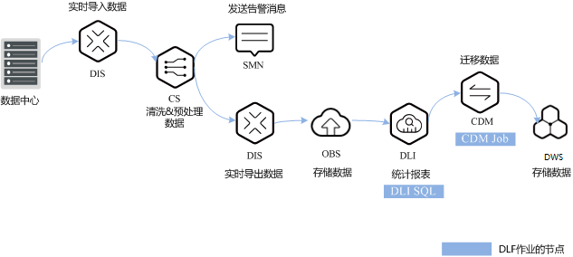
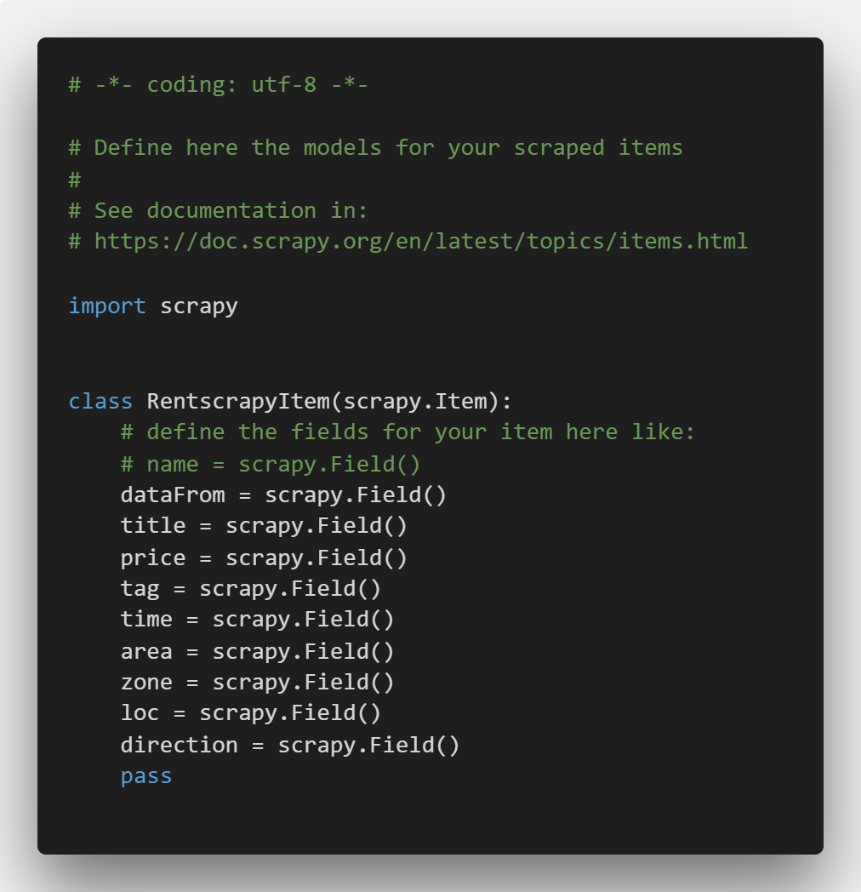
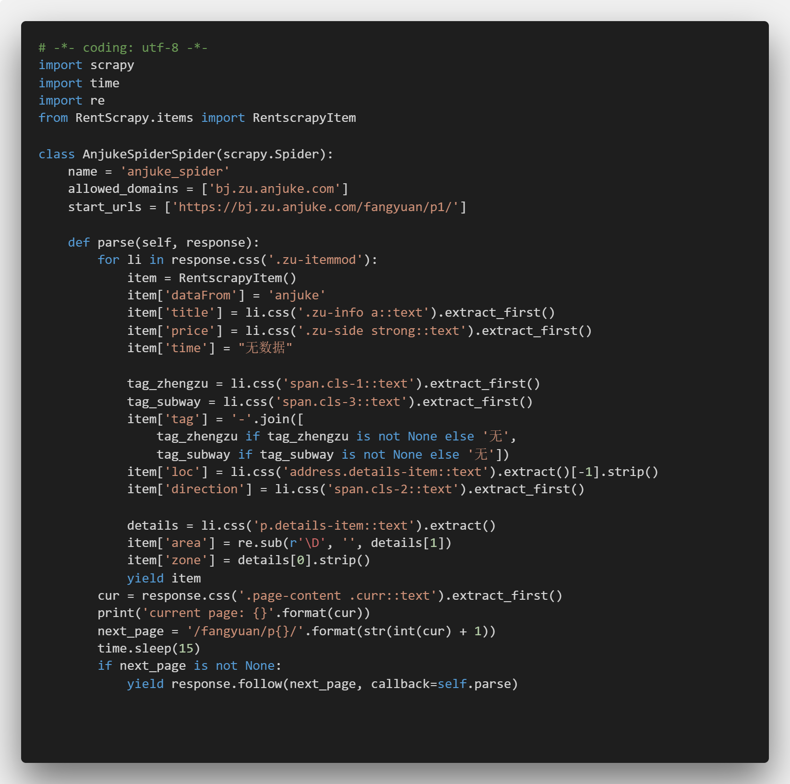
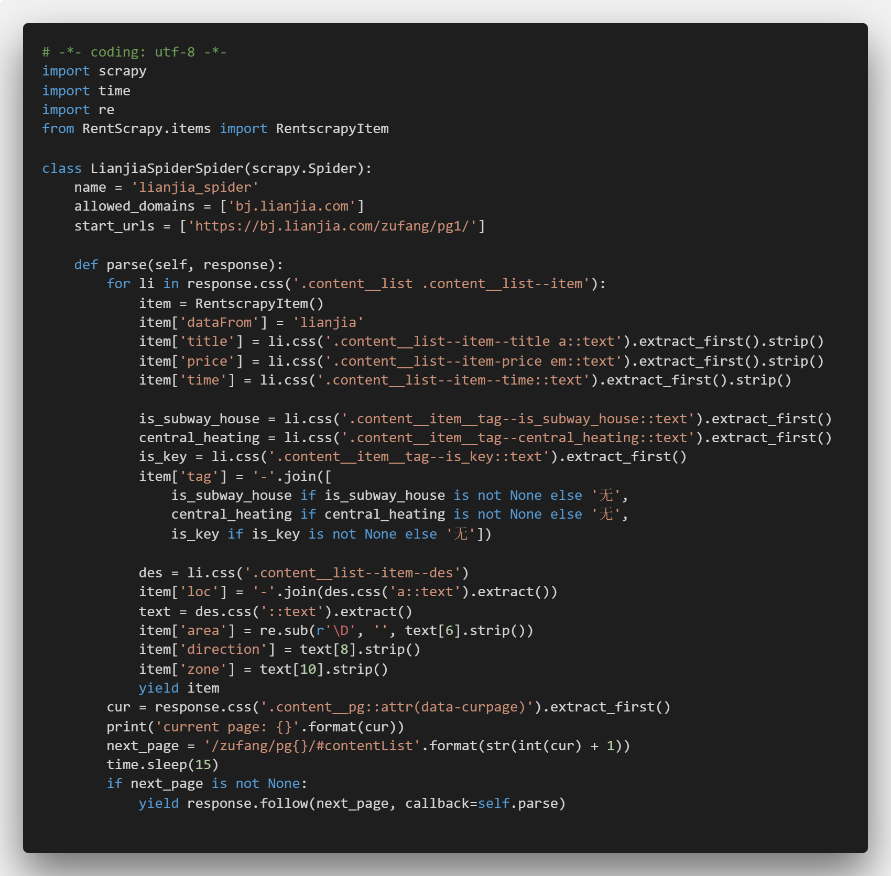
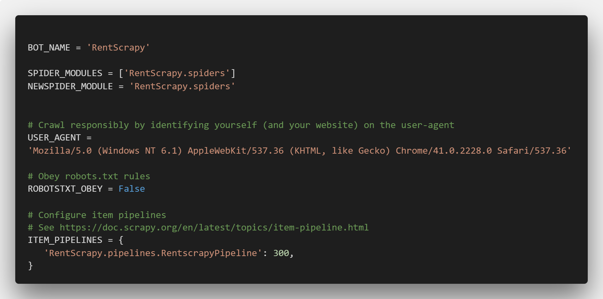
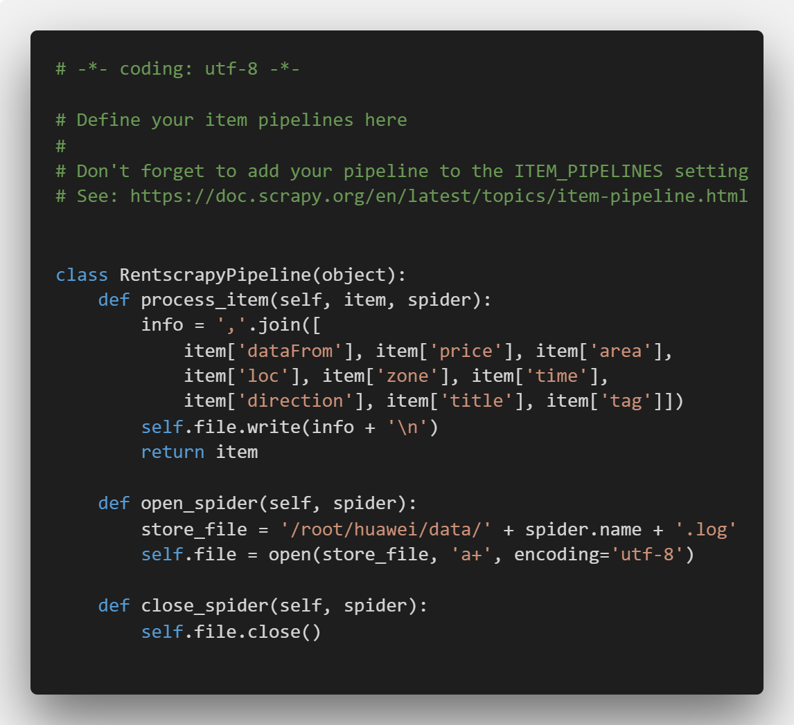
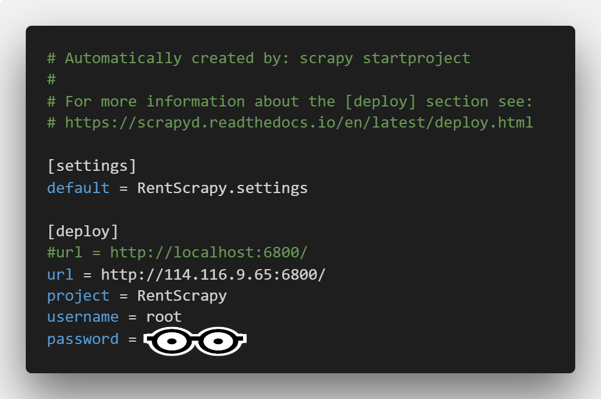

# 华为云数据湖工厂服务DLF-房租信息提醒系统

**Author: zhuantou233**

参考：

> [数据湖工厂DLF-搭建实时报警平台](https://support.huaweicloud.com/bestpractice-dlf/dlf_08_0020.html)

## 1. DLF服务说明

参考官网：https://support.huaweicloud.com/productdesc-dlf/dlf_07_001.html ，数据湖工厂服务（Data Lake Factory，简称DLF）是华为云大数据重要的平台产品，它可管理多种大数据服务，提供一站式的大数据开发环境、全托管的大数据调度能力，极大降低用户使用大数据的门槛，帮助用户快速构建大数据处理中心。

使用DLF，用户可进行数据建模、数据集成、脚本开发、工作流编排、运维监控等操作，轻松完成整个数据的处理分析流程。

简而言之就是，这个是一个集合，也是一个调度中心，你在华为云上使用的大多数服务都可以通过DLF串联起来从而实现一个自动化流水线形式的功能，下面以我的实验来解释DLF的工作流程以及我的个人看法与认知。

## 2. 任务制定及分析

小明同学作为一个北漂技术宅在租房问题上遇到了点问题，他想在北京租到合适而且价格便宜的房子，但是市面上有大大小小各种租房网站，一个一个翻再对比显得有点麻烦，于是乎他想到了可以用华为云的各种服务搞一个自动化系统，从不同的网站获取数据，然后进行筛选过滤，最后将相对合适的一些房源数据展示出来。恩，小明一拍脑瓜子就觉得这个可以搞，然后开始了他的脱发之旅。

整体方案设计类似[数据湖工厂DLF-搭建实时报警平台](https://support.huaweicloud.com/bestpractice-dlf/dlf_08_0020.html)，区别在于数据中心的数据来源，CS清洗数据的条件，DLI统计筛选的条件以及最终存储的位置DWS。



操作流程：

1. 实时数据导入：通过数据接入服务DIS将部署在服务器上的爬虫服务爬取到的数据实时导入到实时流计算服务CS。
2. 数据清洗和预处理：CS对房租数据进行数据清洗和预处理。
3. 发送告警消息：当达到警告条件时向用户发送短信或邮件。
4. 数据导出和存储：清洗过的数据进入DIS通道，DIS根据导入时间将初步筛选出的数据按日期存放到OBS。
5. 输出最终筛选统计报表：通过DLI SQL脚本建立外部分区数据表，以及按照数据获取时间进行统计。
6. 迁移数据：最终筛选统计表计算完成后，将数据通过云数据迁移服务CDM统一导出到DWS数据库。


## 3. 实验环境

* 已开通对象存储服务OBS，并创建桶，例如“s3a://obs-zhuantou233/dlf/rent_output_info/”、“s3a://obs-zhuantou233/dlf/rent_data/”，分别用于存放原始数据表和最终筛选统计表。
* 已开通云数据迁移服务CDM，并创建集群“cdm-zhuantou233”，用于创建CDM作业。
* 已开通数据湖探索服务DLI。
* 已开通消息通知服务SMN。
* 已开通实时数据流计算服务CS。
* 已开通数据湖工厂服务DLF。
* 已开通数据仓库服务DWS，并创建集群“dws_zhuantou233”，用于接收CDM传入的数据。

## 4. 数据源

小明同学的第一个问题是数据从哪来呢，显然，网上这么多的网站，爬就完事了。那么以链家和安居客为例，我们开始用爬虫技术获取房屋租赁信息并保存为log文件，我这里就直接使用Scrapy框架进行爬虫，没有代理IP池没有复杂的请求头，就简单的取数据，延迟设置长一点一般不会被封，还有就是爬虫得到的数据不允许商用，否则律师函警告。

首先看看网站啥样

这是链家租房信息


这是安居客租房信息


关键数据为：
* dataFrom：数据来源
* price：房租价格
* area：面积
* loc：位置
* zone：房型
* time：发布时间
* direction：朝向
* title：名称及描述
* tag：标签

然后就是创建Scrapy项目以及代码完成了，结果如下：

Scrapy项目结构如下，有一部分是运行过程中测试的结果和生成的临时文件，只需要看我说明的文件即可


> item.py



> anjuke_spider.py（这里修正了之前对tag的处理）



> lianjia_spider.py（这里修正了之前对tag的处理）



> settings.py



> piplines.py，两个spider公用一套配置，在piplines中使用spider.name保存不同spider生成的log文件，所有log都保存在`/root/huawei/data/`下



> scrapy.cfg，配置scrapyd远程部署



最后结果保存在`anjuke_spider.log`和`lianjia_spider.log`文件中，文件内容大概类似

```text
anjuke,1940,20,丰台-方庄 群星路,2室1厅,无数据,朝东,正规三居 无取暖费 8min到地铁 芳星园三区,合租-14号线(东)
anjuke,1130,14,朝阳-南沙滩 科学院南里中街,3室1厅,无数据,朝南,水电均摊 精装卧室 集体供暖 科学园南里六区,合租-8/15号线
lianjia,6000,57,朝阳-双井,1室1厅1卫,1个月前发布,东南,南向采光好无遮挡 有钥匙随时看 150米到达双井地铁,近地铁-集中供暖-随时看房
lianjia,4700,50,东城-永定门,2室1厅1卫,1个月前发布,南,整租 · 14号线景泰郭庄北里双朝南两居室,近地铁-集中供暖-随时看房
```

配置`scrapy.cfg`是为了可以部署在服务器上完成爬虫任务，具体需要在服务器上安装scrapyd、配置参数等就不多说了，最终部署成功截图为


这样我们就成功启动两个爬虫同时运行，但是这样仅仅只是爬取一次数据，我需要每天都爬取数据，那么我把这个Scrapy项目复制到服务器上，然后通过另一个python脚本定时启动，脚本如下，每天删除昨天的log文件，然后开启scrapy的spider脚本，再停止1天的时间，这是最简单的方式，虽然有点问题

```python
import os
import time

while True:
    os.system('rm /root/huawei/data/*.log')
    os.system('scrapy crawl anjuke_spider')
    os.system('scrapy crawl lianjia_spider')
    time.sleep(24*60*60)
```

## 5. 调用华为云服务

根据上文我们已经得到了一个每天持续写入数据的数据源，接下来需要上传数据、分析数据、保存数据。

### 5.1 DIS与CS

DIS服务可以监控数据文件的变化并将数据上传，CS服务接收到DIS传来的数据，先进行数据清洗，再转存到OBS上为下一步数据处理做铺垫。

首先在服务器上安装并启动DIS Agent（安装过程必须参考华为云文档，Linux与Windows很不同），具体配置文件如下，这里的输入流为csinput与后面的DIS通道配置呼应

```yml
---
# cloud region id
region: cn-north-1
# user ak (get from 'My Credential')
ak: AIKR0GBW3RIOISDEE1PG
# user sk (get from 'My Credential')
sk: 7Z04p6UTCYObtRjV7wAPtRomnbms0EqYPeHYfUpc
# user project id (get from 'My Credential')
projectId: 5d72f4f9035c4b6e937aa5efa483e83f
# the dis gw endpoint
endpoint: https://dis.cn-north-1.myhuaweicloud.com:20004
# config each flow to monitor file.
flows:
  # DIS stream
  - DISStream: csinput
    # only support specified directory, filename can use * to match some files. eg. * means match all file, test*.log means match test1.log or test-12.log and so on.
    filePattern: /root/huawei/data/*.log
    # from where to start: 'START_OF_FILE' or 'END_OF_FILE'
    initialPosition: START_OF_FILE
    # upload max interval(ms)
    maxBufferAgeMillis: 5000
```

然后就是启动DIS Agent，这里也是一样，Linux只能用`bash start-dis-agent.sh`，非常关键。

接下来是开通DIS通道


其中csoutput通道需要增加转储任务，就是将CS清洗后的数据转存到OBS中，对应上文我建立的桶及文件夹，且目录格式按照时间`yyyy/MM/dd`，这里对后面DLI任务有影响


配置转储任务需要IAM委托，设置如下


然后配置SMN主题以及订阅


最后开启CS作业，CS的功能包括：

* csinput：接收来自DIS Agent的数据
* csoutput：将处理后的数据通过DIS通道再存到OBS中
* message：SMN服务，用于判断从csinput接收到的数据是否满足提醒条件，以向用户发送消息

```sql
/**
  * >>>>>样例输入<<<<<
  *  流名: rent_data(DataFrom,Price,Area,Loc,Zone,ReleaseTime,Direction,Title,Tag):
  *  链家,7500,58,朝阳-双井,1室1厅1卫,一个月前发,西,整租·金港,进地铁/集中供暖/随时看房
  * >>>>>样例输出<<<<<
  *  流名: rent_output_info(DataFrom,Price,Area,Loc,Zone,Direction,Title,Tag):
  *  链家,7500,58,朝阳-双井,1室1厅1卫,西,整租·金港,进地铁/集中供暖/随时看房
  *  流名: rent_msg(MessageContent)
  *  {链家}信息,有最低房价{7500}元,面积在{58}平方米以上，请注意查看！
  **/
  
/** 创建输入流，从DIS的csinput通道获取数据。
  *
  * 根据实际情况修改以下选项：
  * channel：数据所在通道名
  * partition_count：该通道分区数
  * encode: 数据编码方式，可以是csv或json
  * field_delimiter：当编码格式为csv时，属性之间的分隔符
  **/
CREATE SOURCE STREAM rent_data (
  DataFrom STRING,
  Price LONG,
  Area INT,
  Loc STRING,
  Zone STRING,
  ReleaseTime STRING,
  Direction STRING,
  Title STRING,
  Tag STRING
)
WITH (
  type = "dis",
  region = "cn-north-1",
  channel = "csinput",
  partition_count = "1",
  encode = "csv",
  field_delimiter = ","
) TIMESTAMP BY proctime.proctime;

/** 创建输出流，结果输出到DIS的csoutput通道。
  *
  * 根据实际情况修改以下选项：
  * channel：数据所在通道名
  * partition_key：当通道有多个分区时用来分发的主键
  * encode： 结果编码方式，可以为csv或者json
  * field_delimiter: 当编码格式为csv时，属性之间的分隔符
  **/
CREATE SINK STREAM rent_output_info (
  DataFrom STRING,
  Price LONG,
  Area INT,
  Loc STRING,
  Zone STRING,
  Direction STRING,
  Title STRING,
  Tag STRING
)
WITH (
  type = "dis",
  region = "cn-north-1",
  channel = "csoutput",
  partition_key = "DataFrom",
  encode = "csv",
  field_delimiter = ","
);

/** 将部分字段输出 **/
INSERT INTO rent_output_info
SELECT DataFrom,Price,Area,Loc,Zone,Direction,Title,Tag
FROM rent_data
WHERE Price > 0;

/** 创建输出流，结果输出到SMN。
  *
  * 根据实际情况修改以下选项：
  * topic_urn：SMN服务的主题URN，作为消息通知的目标主题，需要提前在SMN服务中创建
  * message_subject：发往SMN服务的消息标题
  * message_column：输出流的列名，其内容作为消息的内容
  **/
CREATE SINK STREAM rent_msg (
  MessageContent STRING
)
WITH (
  type = "smn",
  region = "cn-north-1",
  topic_urn = "urn:smn:cn-north-1:5d72f4f9035c4b6e937aa5efa483e83f:message",
  message_subject = "message",
  message_column = "MessageContent"
);

/** 当1天之内的最低房价在3000以下且面积在15以上的租房信息超过5条，发送提醒消息到SMN服务，实现用户手机终端实时提醒功能 **/
INSERT INTO rent_msg
SELECT DataFrom || "信息，有最低房价" || CAST(Price as VARCHAR(20)) || "元，面积在" || CAST(Area as VARCHAR(20)) || "平方米以上，请注意查看！"
FROM (
  SELECT DataFrom, Min(Price) as Price, MIN(Area) as Area, COUNT(Price) as low_price_count
  FROM rent_data
  WHERE Price < 3000 AND Area > 15
  GROUP BY TUMBLE (proctime, INTERVAL '1' DAY), DataFrom
)
WHERE low_price_count > 5;
```

若之前的步骤正确且服务正常，则我们能在OBS上看到转存的文件，注意这是csv文件（虽然后缀没有csv）


以及CS数据流监控的变化


### 5.2 DLI与DWS

现在我们已经得到了按照时间文件夹排序的csv文件，那么我们需要建数据库和数据表保存csv中的数据，再进行数据筛选。

> 第一步，在DLI服务中建数据连接、数据库和数据队列


> 第二步，在DLF中建立DLI SQL脚本

脚本1-create_table，只需要执行一次，目的是建立从OBS到DLI的数据表rent_output_info，以及保存DLI筛选后的数据表rent_data，这里虽然路径path下面没有数据，但是后面后修正（注意这里增加了一个字段InfoTime用于保存数据获取的时间）

```sql
create table
  rent_output_info(
    DataFrom string,
    Price long,
    Area int,
    Loc string,
    Zone string,
    Direction string,
    Title string,
    Tag string,
    InfoTime string
  ) using csv options(
    path 's3a://obs-zhuantou233/dlf/rent_output_info'
  ) partitioned by(InfoTime);
  
create table
  rent_data(
    DataFrom string,
    Price long,
    Area int,
    Loc string,
    Zone string,
    Direction string,
    Title string,
    Tag string,
    InfoTime string
  ) using csv options(
    path 's3a://obs-zhuantou233/dlf/rent_data');
```

脚本2-insert2rent，这个是后面的DLF中的DLI SQL节点，主要是从OBS上按照时间路径导入数据并且完成筛选功能，这个脚本需要保存而且会多次运行（取决于DLF任务调度）

```sql
ALTER TABLE
  rent_output_info
ADD
  PARTITION (InfoTime = ${yesterday}) LOCATION 's3a://obs-zhuantou233/dlf/rent_output_info/${file_yesterday}';
  
INSERT INTO rent_data
SELECT
  *
FROM
  (
    SELECT
      *
    FROM
      rent_output_info
    WHERE
      Price < 7000
      AND Area > 40
      AND Loc LIKE "%朝阳%"
      AND (Title LIKE "%整租%" OR Tag LIKE "%整租%")
    UNION
    SELECT
      *
    FROM
      rent_output_info
    WHERE
      Price < 2500
      AND Area > 10
      AND Loc LIKE "%海淀%"
      AND (Tag LIKE "%近地铁%" OR Tag LIKE "%合租%")
  )
ORDER BY
  Price
```

筛选条件很简单：

* Price7000以下且面积40以上，朝阳区，整租的房子
* 以及Price2500以下面积10以上，海淀区靠近地铁的合租房

需要注意的地方是，SQL运行时参数`${参数名}`，在SQL作业中很难使用，在DLF作业节点里很好配置，分别是file_yesterday`#{DateUtil.format(Job.planTime,"yyyy/MM/dd")}`以及yesterday`#{#{DateUtil.format(Job.planTime,"yyyyMMdd")}}`

两个参数都是获取今天的日期（虽然是yesterday），在DLF节点中配置如下


> 第三步，DWS集群dws_zhuantou233建立，没有什么特别的，需要记得加上公网ip，以及创建schema和表rent_data_result，这里是在DataStudio等数据库远程连接软件中完成的

```sql
create schema rent_data_schema;
set current_schema= rent_data_schema;
drop table if exists rent_data_result;
CREATE TABLE rent_data_result
(
  DataFrom VARCHAR(64),
  Price BIGINT,
  Area INT,
  Loc VARCHAR(64),
  Zone VARCHAR(64),
  Direction VARCHAR(64),
  Title VARCHAR(128),
  Tag VARCHAR(128),
  InfoTime VARCHAR(64)
)
with (orientation = column, COMPRESSION=MIDDLE)
distribute by replication;
```

### 5.3 DLF与CDM

在完成DLF作业调度前，需要配置CDM连接，OBS link和DWS link


创建CDM迁移作业


最后回到DLF作业中，我们加上之前配置的DLI节点和现在这个CDM节点


CDM节点配置


作业调度配置，比如每天12点整开始数据筛选及迁移


最后启动作业，若作业成功调度且在调度时刻成功运行，我们将会看到


最后到了检验我们的结果的时刻了，在DataStudio上刷新我们的数据库，查看表rent_data_result的数据


按照价格排序，带有数据源、数据详细信息、数据时间的最终结果就得到了，而且这是一个每天定时更新的表。

## 6. 总结与思考

首先是DLF服务的理解，这个很明显是为了连接其他所有服务的流水线，把其他模块作业一部分功能，叠加起来形成一个稳定的自动化系统，可以说是整个华为云系统的关键组件，如果能灵活的使用应该能成为中小企业的一个业务分支（自动化部分）。

其次是实验过程中的坑：

* 从csoutput中转存到OBS上的数据，这是按照时间目录形成的，在DLI中运行时参数，比如`${yesterday}`这种，给的示例应该是过时了的，DLI语句对参数支持不是很友好，只有在DLF中节点配置才能完整的实现参数传入；
* 爬虫数据的处理，由于两个数据源给出的信息不完全匹配，所以我将一部分数据按我自己的意图划分，最终筛选时只能靠模糊匹配完成，仅有价格面积等信息是完全准确的；
* 以及其他我遇到的但是被解决了却已经忘记的所有坑。

最后是整个项目流程的思考，我仅仅只爬了链家和安居客的数据，后续可以加上其他平台的数据形成一个大数据集，这是其一；其二是，定时任务的处理方式不是很优雅；最后是如果有后台处理，那么可以做一个实时更新的系统应用。


