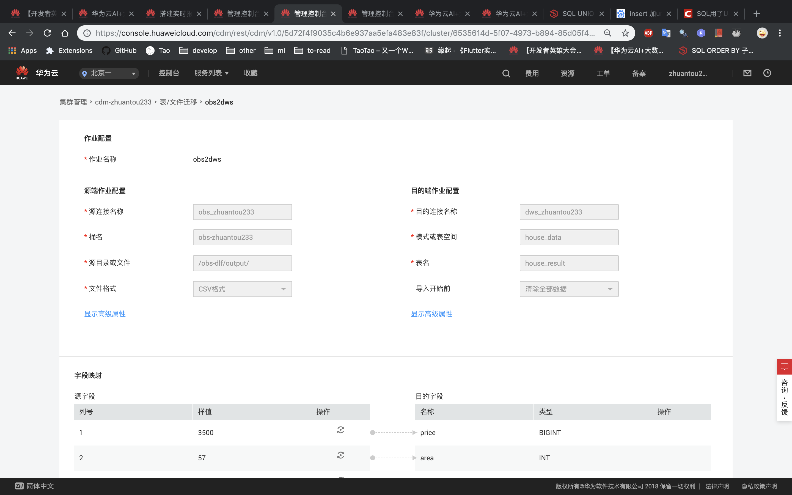

# 数据湖工厂服务DLF

## 1. DLF服务说明

参考官网：https://support.huaweicloud.com/productdesc-dlf/dlf_07_001.html ，数据湖工厂服务（Data Lake Factory，简称DLF）是华为云大数据重要的平台产品，它可管理多种大数据服务，提供一站式的大数据开发环境、全托管的大数据调度能力，极大降低用户使用大数据的门槛，帮助用户快速构建大数据处理中心。

使用DLF，用户可进行数据建模、数据集成、脚本开发、工作流编排、运维监控等操作，轻松完成整个数据的处理分析流程。

简而言之就是，这个是一个集合，也是一个调度中心，你在华为云上使用的大多数服务都可以通过DLF串联起来从而实现一个自动化流水线形式的功能，下面以我的实验来解释DLF的工作流程以及我的个人看法与认知。

## 2. 任务制定及分析

小明同学作为一个北漂技术宅在租房问题上遇到了点问题，他想在北京租到合适而且价格便宜的房子，但是市面上有大大小小各种租房网站，一个一个翻再对比显得有点麻烦，于是乎他想到了可以用华为云的各种服务搞一个自动化系统，从不同的网站获取数据，然后进行筛选过滤，最后将相对合适的一些房源数据展示出来。恩，小明一拍脑瓜子就觉得这个可以搞，然后开始了他的脱发之旅。

### 2.1 数据源

小明同学的第一个问题是数据从哪来呢，显然，网上这么多的网站，爬就完事了。那么以链家为例，我们开始用爬虫技术获取房屋租赁信息并保存为csv文件，我这里就直接使用Scrapy框架进行爬虫，没有代理IP池没有复杂的请求头，就简单的取数据，延迟设置长一点一般不会被封，还有就是爬虫得到的数据不允许商用，否则律师函警告。

首先看看网站啥样


关键数据为：

* price：房租价格
* area：面积
* loc：位置
* zone：房型
* time：发布时间
* direction：朝向
* title：名称及描述
* tag：标签

然后就是尝试以及代码完成了，结果如下：

> spider.py（这里对tag的处理有点问题，虽然没有报错，但是影响了后面的数据）


> item.py


> settings.py


> piplines.py


最后结果保存在`result.csv`文件中，文件内容大概类似


**这里可以把表头删了**

### 2.2 数据上传及保存

由于后续任务需要使用数据库，我们只能将csv文件上传至OBS，再通过DLI服务创建一个表进行数据转换。

* 上传至OBS，这个不用多说，很简单
* 开启DLI服务，创建SQL作业，然后创建队列、数据库（使用默认的也可以），然后相对复杂一点的部分是根据OBS的csv文件生成表，代码很简单，如下

```sql
create table house_no_head(
  price long,
  area int,
  loc string,
  zone string,
  time string,
  direction string,
  title string,
  tag string
) USING csv OPTIONS (path "s3a://obs-zhuantou233/obs-dlf/result.csv")
```

执行完成后可以通过执行下面的语句观察是否正确的导入了数据

```sql
select * from house_no_head
```

### 2.3 通过DLF调用CDM

这是根据实验要求的步骤，将最终得到的结果迁移至DWS的表中，先考虑数据怎么流向CDM的。

我的步骤是：现在我们已经得到了在数据库中存储的数据了，下一步是通过SQL语句筛选我们需要的数据，筛选完成后自动将数据以csv格式保存在OBS上，同时CDM提供的数据迁移自动运行将OBS上筛选完成的数据导入到DWS的表中，最后我们通过数据库连接软件就可以查看目标数据及筛选过的房源信息。

> 第一步，不是在DLF上筛选数据并保存，先通过DLI建立一个空表analysis_output用于保存筛选后的数据

打开DLF服务，新建一个DLI SQL脚本（DLF这里建表等同于在DLI中建表），然后代码如下

```sql
create table
  analysis_output(
    price long,
    area int,
    loc string,
    zone string,
    time string,
    direction string,
    title string,
    tag string
  ) using csv options(path 's3a://obs-zhuantou233/obs-dlf/output');
```

运行这个脚本就会生成一个空表，需要注意的是output是一个文件夹，最后筛选的数据并不是一个完整的csv文件，而是被切割成很多份的csv文件，保存在一个随机生成的文件夹中，大致类似下图


> 第二步，在DLF上筛选数据并保存到analysis_output表中，此时就会生成上图所示的文件，筛选的过程也很简单，也是通过新建一个DLI SQL脚本，代码如下

```sql
INSERT INTO
  analysis_output
SELECT
  *
FROM
  (
    SELECT
      *
    FROM
      house_no_head
    WHERE
      price < 7000
      AND area > 40
      AND loc LIKE "%朝阳%"
      AND title LIKE "%整租%"
    UNION
    SELECT
      *
    FROM
      house_no_head
    WHERE
      price < 5000
      AND area > 30
      AND loc LIKE "%海淀%"
      AND tag LIKE "%近地铁%"
  )
ORDER BY
  price
```

这个逻辑是筛选出朝阳区整租类型的房价在7000以下，房屋面积在40以上的数据，以及海淀区靠近地铁的房价在5000以下，房屋面积在30以上的数据的并集（北京的同学真是处于水深火热当中）。假如我们从多个平台爬取了数据，在这里就可以进行整合，从不同的表中select即可。

运行这个脚本后就会生成上图所示的文件，最后记得保存这个脚本。

> 第三步，OBS到DWS数据迁移

理论上在生成筛选数据后完全可以脱离DLF，直接使用CDM服务做数据迁移，但是为了形成这个流水线，我们还是要讲CDM节点加入到DLF作业中去。

前提步骤都是与CDM作业相同的，首先创建DWS集群（注意需要公网IP），通过数据库连接软件连上之后创建schema和表用于保存迁移过来的数据，也就是最终我们看到的数据，代码如下

```sql
create schema house_data;
set current_schema= house_data;
drop table if exists house_result;
CREATE TABLE house_result
(
  price BIGINT,
  area INT,
  loc VARCHAR(64),
  zone VARCHAR(64),
  time VARCHAR(64),
  direction VARCHAR(64),
  title VARCHAR(128),
  tag VARCHAR(128)
)
with (orientation = column, COMPRESSION=MIDDLE)
distribute by replication;
```

代码很简单，创建schema名为house_data，创建表为house_result，注意这里的变量类型与之前DLI中不同，string转为varchar，由于title和tag字段过长需要更大的长度（这是实验过程中了解的）。

然后是创建CDM集群，创建OBS连接以及DWS连接，然后创建迁移作业，如下图所示


作业的部分配置如下



从这张图可以看出为什么上面爬虫的时候我说tag的处理有点问题，在这里数据迁移时将tag字段切割了，导致最终的数据丢失部分


此时CDM的作业可以运行一次检查CDM是否配置完成，也可以不运行，因为最后我们要通过DLF启动，这个过程中会自动运行筛选以及迁移两个步骤。

## 3. 运行结果

上述步骤都测试完成后，我们可以删除测试过程产生的表以及数据等等，这里就不细说，懂的人自然懂，然后我们在DLF中创建作业，一个节点是DLI筛选，另一个节点是CDM数据迁移


上述作业运行成功后在数据库连接软件上刷新一下就可以找到这张迁移过来的表house_result，然后结果也如我们所设计的一样，房价、面积、位置要求等等信息一目了然。


## 4. 总结与思考

首先是DLF服务的理解，这个很明显是为了连接其他所有服务的流水线，把其他模块作业一部分功能，叠加起来形成一个稳定的自动化系统，可以说是整个华为云系统的关键组件，如果能灵活的使用应该能成为中小企业的一个业务分支（自动化部分）。

然后是整个项目流程的思考，我仅仅只爬了链家的数据，后续可以加上其他平台的数据形成一个大数据集，这是其一；其二是爬取过程完全是我手动操作再导入到OBS上，根据我在CS作业中的理解，我觉得是可以通过DIS自动上传数据到OBS，然后定时调动DLF作业，那样就可以形成一个自动化的租房信息系统，再加上SMN消息通知，感觉这个已经是一个完整的系统了，后续会加上我所说的这些功能吧，毕竟也不是很复杂，一步一步来。


